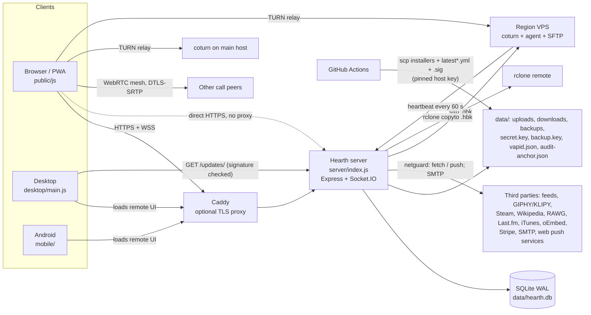
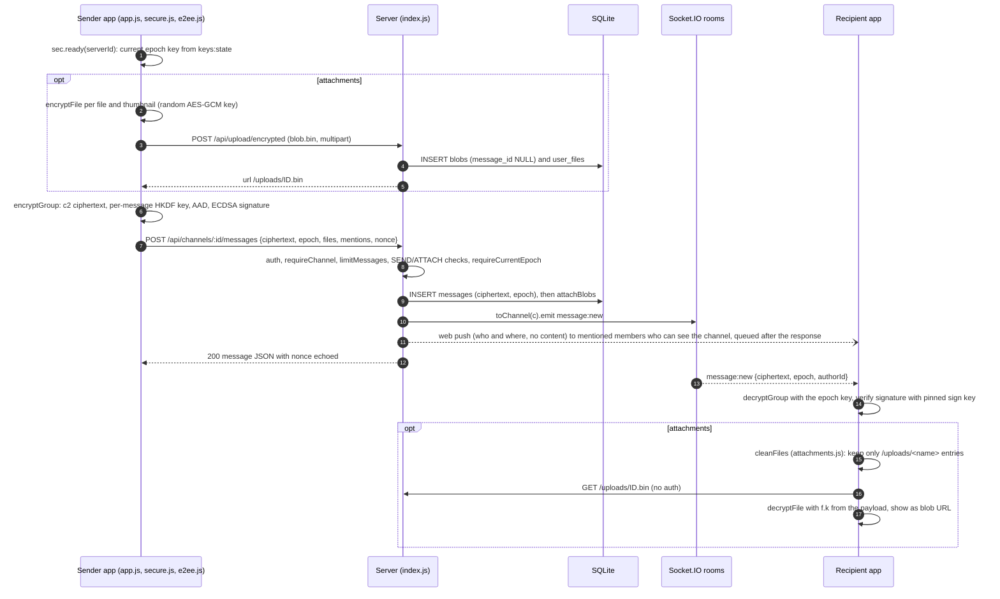

# Hearth architecture overview

Hearth 1.27.1 is a self-hosted chat app with end-to-end encrypted (E2EE) messages and files. One Node process runs
everything: the HTTP API, Socket.IO, voice signaling, background jobs and backups. It stores data in one SQLite file.
This overview describes the code after the 2026 security overhaul (see [ENGINEERING-REPORT.md](ENGINEERING-REPORT.md)).
Paths are relative to `hearth/`, except `.github/`, which is at the repository root. Line numbers appear only in
section 7. Everything else is cited by file and function name. Every HTTP route and socket event is listed in
[ROUTES.md](ROUTES.md); what each protection guarantees is in [SECURITY.md](../SECURITY.md).

## 1. Components and entry points

| Component | Entry point | What it is |
|---|---|---|
| Server | `server/index.js` | Express 4 app plus an `api` router mounted at `/api`. Socket.IO 4 is set up in `setupSockets`. An async block at the bottom starts HTTP or HTTPS (`loadTls` makes a self-signed cert if `SSL_CERT` is unset). Feature modules get a shared context object: `accounts.js` (email, 2FA, recovery, reset), `newsbot.js` (feeds, trackers), `study.js` (Recall sync), `activity.js` (games and music), `regions.js` (relays), `money.js` (Ko-fi and Stripe supporter badge), `memberships.js` (Stripe Connect tiers), `search.js` (message search). Support code: `db.js` (schema, migrations, sealing, audit chain), `perms.js`, `profile.js`, `page.js`, `backup.js`, and four guards added by the overhaul: `netguard.js` (outbound requests), `proxytrust.js` (which proxies may set the client address), `fetchlimit.js` (streamed size caps on `fetch()` answers) and `imagemeta.js` (strips picture metadata in a worker thread). `cli.js` is an operator CLI for TURN settings, backups and `set-owner`. |
| Web client | `public/index.html` | Loads `/socket.io/socket.io.js` and `public/js/app.js` as ES modules. There is no build step. Main modules: `api.js` (REST calls with a bearer token), `conn.js` (when a closed live connection means "signed out" and when it only reconnects), `e2ee.js` (crypto primitives), `secure.js` (key manager), `attachments.js` (keeps only attachment entries on this server), `search-query.js` (the search language, matched on the device), `voice.js`, `relays.js`, `watch.js` (calls), `recall-host.js` plus `public/recall/` (study app in a sandboxed iframe), and `sw.js` (service worker, push, offline shell). |
| Desktop | `desktop/main.js` | Electron app. The local `connect.html` picks a server. Then the `BrowserWindow` (`contextIsolation`, `sandbox`) loads the remote server origin. `preload.js` exposes `window.hearthDesktop`. `origin.js` does every exact-origin check, `permissions.js` decides which page permissions need the person's yes, `picker.html` is the app's own screen picker, and `update-verify.js` checks signed updates (Ed25519, key from `hearth.config.json` `updatePublicKey`). `detect.js` detects games and music, and `hotkeys.js` provides global push-to-talk. `build/sign-update.js` makes keys and signs `latest*.yml` in CI. |
| Android | `mobile/` | Capacitor 8 shell. `www/index.html` is the connect page, and then the WebView loads the remote server. `native/MainActivity.java` keeps navigation on that origin, prompts on certificate fingerprints, and runs the `HearthAndroid` bridge (notifications, file saving). `native/BridgePolicy.java` lets only the local connect screen change the saved server. The page side is `public/js/android.js`. |
| Relays / regions | `server/regions.js` | An admin adds a region (password re-confirmed) and gets a `curl … \| sudo bash` command for `/regions/install/:id?k=`. The script installs coturn with the instance TURN secret, an upload-only SFTP account for backups, and an agent. A systemd timer runs the agent every minute to POST `/api/regions/:id/heartbeat`; the address it reports must be public. |
| TURN | `scripts/setup-turn.sh`, `deploy/turnserver.conf` | coturn in `use-auth-secret` mode with `denied-peer-ip` for private ranges and `no-tcp-relay`. `setup-turn.sh` also sets `max-bps` (`TURN_MAX_MBIT`, default 6) and `bps-capacity` (`TURN_CAPACITY_MBIT`). The sample `turnserver.conf` ships with `static-auth-secret` commented out and no bandwidth cap. The server issues credentials in `iceServersFor`. |
| Caddy | `deploy/Caddyfile` | Optional reverse proxy (compose profile `domain`). It terminates TLS and does `reverse_proxy hearth:3000`. |
| Hosting | `Dockerfile`, `docker-compose.yml`, `deploy/hearth.service`, `scripts/harden-vps.sh` | Docker, or systemd on a VPS. `docker-compose.yml` puts Caddy on a fixed network (`10.231.47.0/28`) and sets `TRUST_PROXY` to it unless `.env` names another proxy. |



## 2. Request and real-time flow

**Middleware order** (as registered in `server/index.js`):

1. `app.set('trust proxy', trustProxySetting(TRUST_PROXY))` (`proxytrust.js`). Unset means `loopback`: only a proxy on
   this machine may set the client address. A number is a hop count, `false` trusts nobody, and addresses or subnets
   name the proxies. `socketIp` runs the same walk (`clientIp`) for Socket.IO. When `X-Forwarded-For` arrives from an
   untrusted address, the server logs a one-time hint with a safe `TRUST_PROXY` value (`ignoredXffHint`).
2. `directGuard`. When `HTTPS=false` and `ALLOW_DIRECT_HTTP` is not `true`, requests from public peer addresses get a 403. The same check is Socket.IO's `allowRequest`.
3. `express.json({ limit: '2mb' })`. It keeps the raw body for `/api/pay/*`, so webhook signatures can be checked.
4. Security headers on every response: nosniff, `X-Frame-Options: DENY`, COOP, Permissions-Policy, and HSTS when the request is secure. `cspFor` sets the CSP on everything except `/uploads/` and `/media/`. `connect-src` is `'self'` plus the server's own `wss:`; `img-src` and `media-src` allow any `https:`. `/api/` responses get `no-store` and CORP.
5. File routes: `/uploads/:file`, `/manifest.webmanifest`, `/sw.js`, `/download`, `/terms`, `/updates/:file` (installers, `latest*.yml` and `latest*.yml.sig`), `/downloads/:file`.
6. The CSP middleware for `/recall`, then an in-memory brotli/gzip handler for text assets, `express.static(public/)` and `/vendor/argon2.js`.
7. `app.use('/api', api)`. Inside the router: a gzip wrapper on `res.json` for bodies of 4 KB or more (256 KB or more are compressed off the main thread), an IP-ban guard on `/auth/register`, `/auth/login`, `/auth/forgot` and `/auth/reset`, then the routes. **There is no router-wide auth.** Each route lists the `auth` middleware itself, and staff routes add `staffOnly`, `adminOnly` or `ownerOnly`.
8. App-level routes registered later in the file: `/media/gif` (index.js), `/media/news` (newsbot.js), `/media/art` and `/media/game` (activity.js), `/regions/install/:id` (regions.js).
9. `api` 404 JSON handler, then the error handler, then the SPA fallback for GETs outside `/api`, `/uploads` and `/socket.io`. The error handler returns `HttpError` messages to the client. For any other error it calls `console.error(err)` and returns a generic message.

**Auth.** The client fetches its KDF salt from `GET /api/auth/params`. `deriveKeys` in `e2ee.js` runs Argon2id and then HKDF. The result is an `authKey`, which is sent, and a `wrapKey`, which never leaves the device. The client solves a proof-of-work captcha (`GET /api/captcha`, `public/js/captcha-worker.js`). `POST /api/auth/login` then runs these steps in order:
- the per-network limit;
- `verifyCaptcha` (before every shared counter, so junk without a solved check counts against nobody else; it also refuses a check easier than the current difficulty with `captcha_harder`);
- the account's limits: a known device (a signed `device` note) or known network has its own daily bucket; anything else counts toward the per-account limits and the instance-wide counter (`countInstanceWide`, which raises the difficulty when busy instead of refusing, unless the captcha is off);
- a bcrypt compare (against `DUMMY_HASH` when the user is unknown);
- `require2fa` in `accounts.js`;
- `createSession`.

The session token is 32 random bytes, returned once. The DB stores only its SHA-256 (`sessions.token_hash`). The client keeps the token in `localStorage['hearth.token']` and sends `Authorization: Bearer`. No cookies are used.

The `auth` middleware calls `sessionFor`, which accepts a 64-hex token whose session is not revoked, not past `expires_at` (default 365 days) and not idle for more than 60 days. It then rejects deleted users (401), suspended users (403), non-staff from a banned IP (403) and non-staff during maintenance (503); `POST /auth/logout` is always let through. On success it sets `req.userId` and `req.session`, touches `last_used_at` at most once a minute, and records the IP.

`stepUp` re-checks the `authKey` (10 tries per 10 minutes, a right password gives its try back), and the 2FA code unless the session passed 2FA in the last 10 minutes. It guards: password, username, email and recovery-key changes; account deletion; `POST /me/keys/wrapped`; deleting or transferring a server; staff and ownership changes; deleting a backup, lowering backup retention, viewing the backup key; payment destinations (`PUT /admin/money`, the funding link in `PUT /admin/owner`, the memberships key and webhook secret); `PUT /admin/turn`; creating and reinstalling regions. `POST /me/2fa/disable` always needs a fresh code.

**Authorization.** `server/perms.js` defines 17 permission bits plus ADMINISTRATOR. `perms.base` gives server-level permissions and `perms.channel` applies channel overrides. The route helpers are `requireServer`, `requireChannel`, `requirePerm`, `requireOwner` and `requireDm`. Routes keyed by a channel, message, role or event ID load that row and check membership against its own `server_id`. Role assignment checks position and that the role's permissions (and its channel overrides) are a subset of the caller's. Override edits need Manage Roles in that channel and are refused when they touch, or take permissions away from, people at or above the editor. Channel edits need Manage Channels in that channel. `removeMember` deletes the member's roles, member overrides and RSVPs and records them in `former_members`. Instance staff come from `staffRole` and `ownerId`: the `owner` setting (settled once), `ADMIN_USERS` names claimed by account id (`envAdminClaims`), then the `staffRoles` setting.

**Rate limiting.** `rateLimit(key, max, windowMs, cost)`, `countHit` and `limitNet` in `server/index.js` use an in-memory `Map` with fixed windows. Keys combine the user, the session, the network (IPv4 address or IPv6 /64) and a global key. The counters reset on restart and are not shared between processes. Examples:
- `limitMessages`: 30 per 10 s per user, 1500 per hour per user, 25 per 10 s per session, 120 per 10 s per network.
- Uploads (`limited`): 60 per minute per user, 600 per hour per user, 40 per minute per session, 150 per minute per network, and at most 4 in progress per user.
- Login: 20 per 10 min per network, then (after the captcha) per-account and instance-wide counters. Registration: 5 per hour and 10 per day per network.
- Joining a server: 20 per hour per user, 60 per network. Profile writes: 30 per minute and 300 per hour per user, 120 per minute per network. Search: 60 per minute per user. `GET /api/ice`: 60 per hour per user.

**Socket.IO.** Options: `pingInterval` 10 s, `maxHttpBufferSize` 256 KB, `allowRequest` = `directGuard`.
- *Handshake* (`io.use`): `handshake.auth.token` goes through `sessionFor`. The user must not be deleted or suspended. The IP must not be banned and maintenance must be off (staff are exempt from both). At most 30 sockets per user, and 60 handshakes per minute per user (`too_many_connections`, `rate_limited`). The middleware stores `socket.data.sid`.
- *On connect*: each socket gets a bucket of 40 events (refilled 10 per second) and every event also spends from a per-user budget shared by all of that user's sockets (120, refilled 30 per second). A call's `voice:signal` events from the socket in the call have their own bucket (200, refilled 50 per second). Refused events are answered "Slow down."; strikes are forgiven 5 per second, and after more than 50 the socket gets a `flood` event and is disconnected. The socket joins `user:<uid>`, `admins` (staff only) and `server:<sid>` for each membership. Presence is broadcast.
- *Per event*: `guard(fn)` wraps every handler. It acks `{ok:true}` or `{error}`. Each handler runs its own checks (`requireChannel`, `requireDm`, voice-room membership, blocks for typing). `voice:signal` data is capped at 64 KB. Typing is passed on at most once a second per user.
- Client-to-server events are `typing`, `voice:*`, `call:decline` and `watch:*`. Everything else goes over REST, and the server pushes the resulting events (`message:new`, `dm:message`, `keys:state`, `voice:state`, `voice:perms` and others).
- *Revocation*: `revokeSessions` disconnects the matching sockets with `session:revoked`. A 60-second sweep closes sockets whose session has ended. On the client, `conn.js` treats only `session:revoked` or a refused reconnect (`unauthorized`) as a sign-out; any other server-side close reconnects.

**Sending a channel message.** On the client this starts in `sendTo` (`public/js/app.js`). On the server it is `POST /channels/:id/messages` (`server/index.js`).



`toChannel` emits to `server:<sid>`. For a restricted channel it emits only to the `user:<uid>` rooms of members who have VIEW. DMs follow the same pattern: `encryptDm` builds a `d2:` ciphertext, the client calls `POST /api/dms/:id/messages`, and the server emits `dm:message` to the two `user:` rooms.

**Searching messages** (`server/search.js`). `GET /api/search/messages` takes only `scope` (`c:`, `d:`, `s:` or `all`), `from`, `before`, `after`, `cursor` and `limit` (1–200). Access is worked out again on every request; for `all` and `s:` it looks at no more than 100 conversations per page (those with the newest matches) through covering indexes. It returns ciphertext serialized exactly like the history routes. The words, phrases and `has:`/`is:` filters stay on the device (`search-query.js`), which decrypts each page and matches there, up to 1,000 messages per click.

## 3. Data model overview

`server/db.js` opens one `better-sqlite3` connection in WAL mode with `foreign_keys=ON`. All queries run synchronously on the event loop. The schema version is `PRAGMA user_version` = 17 (`SCHEMA_VERSION`). Tables use `CREATE TABLE IF NOT EXISTS` plus `addColumn`, and some data migrations are gated on the version. Users are soft-deleted (`deleted_at`).

**Migrations.** If the file's `user_version` is above `SCHEMA_VERSION`, `db.js` throws `HEARTH_DB_TOO_NEW` without touching the file. Before upgrading a database that has accounts, it writes one consistent copy with `VACUUM INTO` to `data/backups/hearth-before-v17-<ts>.db` (via a `.partial` name; skipped when a copy newer than the data already exists). Everything from `BEGIN IMMEDIATE` (after `PRAGMA foreign_keys = ON`) to the `user_version` bump runs as one transaction, so an interrupted upgrade changes nothing and runs again on the next start. The `// v17 (…)` blocks from each batch run inside it.

| Area | Tables | Ciphertext / sealed / hashed | Plaintext metadata |
|---|---|---|---|
| Accounts | `users`, `user_key_history` | `enc_private_key`, `enc_private_key_recovery`, `enc_sign_private_key` (encrypted client-side). `auth_hash` = bcrypt(authKey). `totp_secret` sealed with `secret.key`. Backup codes are HMACs. | username, email, profile/page JSON, privacy, public and signing keys (kept after deletion), retired public keys (`user_key_history`), `last_ip`, `last_seen_at`, activity, supporter fields |
| Sessions | `sessions`, `auth_tokens`, `user_ips`, `push_subs` | session token and reset token stored as SHA-256 | user agent, IPs, timestamps, `mfa_at`; push endpoint, keys, `session_id`, `fails`, `retry_at`; reset tokens record the email they were sent to |
| Structure | `servers`, `channels`, `members`, `roles`, `member_roles`, `channel_overrides`, `invites`, `bans`, `emojis`, `former_members` | none | names, topics, themes, permissions, membership, who left when |
| Messages | `messages`, `dm_messages`, `dm_channels`, `reactions`, `poll_votes`, `poll_closed` | `messages.ciphertext` (`c2:`), `dm_messages.ciphertext` (`d2:`). Legacy pre-E2EE and news-bot bodies are in `messages.body`, sealed with `secret.key`. | author, channel/DM, `epoch`, `reply_to`, `thread_id`, timestamps, pins, reaction emoji, poll choice indexes |
| Group keys | `server_epochs`, `server_keys`, `server_key_reports` | `server_keys.wrapped` (`w1:`, ECIES per member, at most 600 characters). `key_check` is a truncated hash. | epoch numbers, who made each epoch and when, who wrapped for whom, who reported a key broken |
| Files | `blobs`, `user_files`, `gif_library` | `.bin` contents on disk | names, sizes, uploader, linked message; GIF-library uploads count in `user_files` |
| Recall | `study_items` | `data` (`x1:` vault ciphertext) | kind, size, timestamps |
| Events / feeds | `server_events`, `event_rsvps`, `feeds`, `feed_seen`, `user_feeds`, `user_feed_items` | none | everything |
| Moderation | `reports`, `staff_notes`, `admin_log` | none | Report evidence is the plaintext the reporter submits, plus the target's IPs. `admin_log` is append-only (triggers) with an HMAC-SHA256 chain (see §12). |
| Money | `payments`, `creator_accounts`, `membership_tiers`, `memberships`, `membership_cancellations` | none | Stripe IDs, amounts, statuses, cancellations still to confirm |
| Instance | `instance_settings`, `regions`, `game_catalog`, `profile_comments` | Sealed (`sealed:` prefix, `sealSecret`): the SMTP password, the GIPHY/KLIPY/Last.fm/RAWG keys, the Ko-fi token, the supporter Stripe signing secret, the memberships Stripe key and webhook secret. | Other settings, including the TURN secret, `owner`, `envAdminClaims`, `e2eeSince` and `auditKeyedFrom`. |

Hot lookups have indexes added in v17: members by user, channels by server, DMs and friend requests by either side, a member's server keys, reports by target, push subscriptions by session, and the covering indexes `search.js` uses.

Server-side key files live in `data/`. `secret.key` (or the `AT_REST_KEY` env var) is the AES-256-GCM key for `seal`/`unseal`; it also keys the HMACs (media tokens, captcha challenges, fake KDF salts, 2FA backup codes) and, through HKDF, the audit-log chain. The others are `backup.key` (or `BACKUP_KEY`), `vapid.json`, `audit-anchor.json` and `region-backup/id_ed25519`.

## 4. Encryption architecture and key ownership

All E2EE runs in the browser through WebCrypto (`public/js/e2ee.js`). `public/js/secure.js` manages the keys for each session.

| Key | Made by | Where it lives | Protection |
|---|---|---|---|
| Password master | Argon2id (64 MiB, 3 passes, 16-byte random salt). Legacy accounts use PBKDF2 and are upgraded at their next login. | never stored | - |
| `authKey` / `wrapKey` | HKDF(master, `hearth-auth-v2` / `hearth-wrap-v2`) | The server stores bcrypt(authKey). `wrapKey` stays in browser memory. | - |
| Identity key (ECDH P-256) | `createIdentity`, at registration or on a reset without recovery | `users.enc_private_key`, returned only by login, reset and `POST /me/keys/wrapped` (step-up), never by `/bootstrap`. The unwrapped key is stored non-extractable in IndexedDB `hearth/keys`. | AES-GCM under `wrapKey` |
| Signing key (ECDSA P-256) | `createSigningKey`, uploaded via `/me/sign-key` after `/me/sign-key/challenge` | `users.sign_public_key`, `enc_sign_private_key` | HKDF(ECDH(id, id)) "self key"; the upload proves possession of the identity key and the signing key |
| Server group key | 32 random bytes per epoch, generated by a member's client (`secure.js` `rotate`) | `server_keys` (one wrap per member), `server_epochs.key_check` | `wrapGroupKey`: ephemeral ECDH to the recipient, HKDF, AES-GCM. Context `hearth-gk\|server\|epoch\|recipient\|wrapper` is both HKDF info and AAD. Signed by the wrapper. Each member's app re-wraps the keys it holds to itself (`POST /servers/:id/keys/self`). |
| Channel message key | HKDF(group key, random 32-byte salt, `hearth-msg-v2\|channelId`) | not stored | Format `c2:<epoch>:<salt>:<iv>:<ct>:<sig>`. AAD `hearth-c2\|channelId\|epoch\|authorId`. ECDSA-signed. Plaintext padded (`padded`). Message id, reply, thread, time and edit version are not bound. |
| DM message key | HKDF(ECDH(me, peer), random salt, `hearth-dm-v2\|dmId`) | not stored | Format `d2:<salt>:<iv>:<ct>`. AAD binds the DM and the author. Not signed. |
| File key | random 256-bit key per file and per thumbnail (`encryptFile`) | inside the encrypted message payload (`f[].k`) | blob = iv‖ct, uploaded as `.bin`, not padded |
| Recovery key | 32 base32 characters (160 bits) from `newRecoveryCode` | Shown once to the user. The server holds only the rewrapped identity key (`PUT /me/recovery`, behind step-up). | HKDF(code, `recovery_salt`) + AES-GCM |
| Recall vault key | HKDF(ECDH(id, id)) | not stored | `x1:` AES-GCM, AAD `hearth-vault\|kind\|id` |
| At-rest key | `data/secret.key` | server | used for `seal()`: legacy messages, news-bot posts, TOTP secrets and the sealed settings in §3; HKDF of it keys the audit chain |
| Backup key | `data/backup.key` or `BACKUP_KEY` | server | see section 11 |

**Group key lifecycle.** The server sends each member `keys:state` (from `keyState`, only to members online at that moment; others read it from `/bootstrap`): the current epoch, `needsRotation`, `keyCreatorId`/`keyCreatedAt`, the member's own wraps and the list of members who still need the key. `secure.js` `applyState` checks each wrap's signature against the wrapper's signing key and the `key_check`, then unwraps it. It refuses a current key wrapped by a non-member and never moves to a lower epoch within a session.
- `POST /servers/:id/keys/rotate` requires `epoch = current + 1`, a well-formed wrap for every current member, and runs in a transaction. A rotation nobody needs (or one by whoever caused the need, `causedRotation`) goes through `limitVoluntary`: non-managers wait until the current key is 10 minutes old and while fewer than 12 epochs were made in the server in the last hour; Manage Server holders have 30 an hour of their own. Refused attempts don't count.
- `POST /servers/:id/keys/share` adds wraps of the current epoch for members who lack it. The sharer must hold the current epoch, and shares are refused (409 `epoch`) while `needs_rotation` is set.
- `POST /servers/:id/keys/bad` deletes the caller's own wrap of the current epoch only. When the wrap came from the epoch's creator, `reportBroken` records a report; two reporters (or the only other member, or one with Manage Server) set `needs_rotation`. Reports count at most 12 per hour per member.
- `removeMember` (leave, kick, ban) sets `needs_rotation` and records `former_members`. `keyOnRejoin` sets it again when a former member (or someone holding old wraps) joins, so a returning account never gets the key made while it was away. Until some member's client rotates, sends and edits return 409. Other joiners receive the current epoch.
- Group DMs are servers with `kind='group'` and use the same group keys.

**Identity trust.** Each device pins other users' keys on first sight, in `localStorage` (`checkPin` / `acceptPin`). A changed key pauses DM sending and key sharing with that user. The safety number is a 60-digit SHA-512 over both users' keys. Account reset (`accounts.js`) works one of two ways. With the recovery key plus an ECDH proof (`resetKeyProof`), the identity key is kept. Without it, the old public keys go to `user_key_history`, a new identity is created, and the user's own `server_keys` rows are deleted (no rotation). `GET /users/:id` and the `/bootstrap` users list carry those as `pastKeys`; a device trusts one only if it pinned it itself, for things written before it was retired, and labels anything else "Older key — not verified". Account deletion erases the private keys but keeps the public ones. At start-up the app refuses keys the server lists for the user that the password doesn't unlock.

**Legacy plaintext.** Rows with no ciphertext are served as `legacy` and labelled "sender not verified". `instance_settings.e2eeSince` (set once) is sent in `/bootstrap`; each device remembers the earliest value it was told and hides legacy channel messages dated after it, except the news bot's.

**What the server can and cannot read** (assuming it serves the shipped client JS):
- **Cannot read:** channel, group and DM message text; attachment contents, file names and types; poll questions and options; Recall items; voice and video media; passwords; recovery keys; private keys; group keys; search words.
- **Can read:** usernames, emails, profiles and profile pages, avatars and other public media, IPs, user agents, session metadata, membership, roles, channel names and topics, who posted where and when, reply and thread structure, pins, reaction emoji, poll vote indexes, events, the @mention user IDs the client sends for push, attachment counts and exact sizes, presence, game and music activity, call participation, watch-together URLs, report evidence submitted by reporters, push endpoints, GIF picks (`/gifs/used`) and proxied GIF loads (the media token names the user and session), and search metadata (scope, author, time window, paging).
- **Can read with `secret.key`:** legacy pre-E2EE messages, news-bot posts, TOTP secrets and the sealed settings.
- All three clients run JavaScript served by the server, and the E2EE keys are derived in that JavaScript (SECURITY.md describes this).
- Private channels use the same server group key as the rest of the server. The server controls who receives their events (`toChannel`).

## 5. Voice and video

- **Mesh.** `public/js/voice.js` builds a full-mesh WebRTC call. A newcomer is the initiator toward every existing peer. Each peer connection has four fixed transceivers (mic, camera, screen, screen audio), switched with `replaceTrack`. Media is DTLS-SRTP between browsers. ICE candidates that arrive before or while an offer is verified are queued and applied in order.
- **Signaling** goes through Socket.IO.
  - `voice:join` checks one of two cases. For a DM call, the user must be a participant and not blocked. For a channel, `requireChannel`, `type === 'voice'` and CONNECT must pass.
  - It returns the peers' socket IDs and rings callees on the first join (`call:ring` plus web push). `call:decline` is accepted only from someone who was rung or could join.
  - `voice:signal` relays `data` (at most 64 KB) only to a socket in the same room, and the server sets `from`/`userId` itself.
  - SDP offers and answers are ECDSA-signed over `hearth-voice|room|from|to|type|sdp`. The receiver verifies them against the sender's TOFU-pinned signing key (`secure.js` `verifySdp`). ICE candidates are unsigned. The client does not check that a signed offer's sender is in the server-reported participant list.
  - Permission changes are re-checked mid-call (`recheckVoice` after role, override, membership and ownership changes): losing CONNECT or VIEW removes the user from the call; losing SPEAK sends `voice:perms` and keeps them shown muted.
  - Call state (`voiceChannels`, `userVoice`, `watchRooms`) lives in memory and is lost on restart; a dropped socket ends the user's call.
- **ICE / TURN.** STUN defaults to Google's servers (`STUN_URLS`). `iceServersFor` adds the main relay (the `turnUrls` setting or `TURN_URL`) and every region seen in the last 3 minutes (`REG.liveRelays`).
  - With a TURN secret set, credentials follow the coturn REST scheme: username `<expiry>:<uid>`, credential base64 HMAC-SHA1(secret, username). The expiry is rounded to a 6-hour boundary, 12–18 hours ahead, so a user has at most three logins alive and coturn's per-user quota applies per person. Each entry carries `expiresAt`; the app refreshes through `GET /api/ice` (60 per hour) before it runs out. The same credential works on every relay.
  - Without a secret, the static `TURN_USERNAME` / `TURN_CREDENTIAL` are used, and the server logs a warning at start-up.
  - The list is delivered in `/api/bootstrap` (and `/api/ice`).
- **Regions.** `relays.js` `rankRelays` measures each relay and caches the result for 6 hours. `chooseIce` uses STUN plus the two fastest relays. `POST /api/calls/region` pins a call to one region (`channels.rtc_region` / `dm_channels.rtc_region`), which forces `iceTransportPolicy: 'relay'`. In a server channel this needs Manage Channels. In a DM or group, any participant can do it.
- **Watch together.** The server keeps the shared player state (at most 64 KB, links up to 2,048 characters, 25 queued items) and rebroadcasts it to `voice:<room>`, merging bursts. In host-only mode only the host skips; a "video ended" report from others advances the queue once most of the call has sent it. It fetches YouTube or Vimeo oEmbed titles. The client's player iframes are sandboxed.
- **What each party sees.**
  - A relay sees encrypted SRTP, packet sizes and timing, peer IPs, and the TURN username (which contains the user ID).
  - A region VPS also holds the instance-wide TURN secret and stores encrypted `.hbk` backups.
  - The Hearth server sees who is in each call, the mute, video and screen flags, and all signaling, including the SDP and the ICE candidates with their IPs.
  - In a direct (non-relayed) connection, peers see each other's IPs.

## 6. Files and uploads

- **Storage.** Uploads go into a flat `data/uploads/`. File names are generated (`newId` + 6 random bytes + a safe extension). Encrypted blobs always get `.bin`. Other folders are `data/cache/art` (activity picture cache, pruned to 400 MB), `data/downloads` (installers and the update feed) and `data/backups`.
- **Upload pipeline.** All uploads are multipart through multer, behind `auth` and `limited(kind, …)`. `limited` applies the rate limits, refuses blocked accounts, allows at most 4 uploads in progress per user (429 `busy`), and caps the file at the smallest of the per-file limit, the quota left and the day's allowance left. Multer also gets `FORM_LIMITS`: 8 text fields of 16 KB, 10 parts (400 `form_limit`). Public pictures (`image` and `gif` kinds) then go through `imagemeta.js` in a worker thread, which strips EXIF/XMP/IPTC/comments/trailing data from JPEG, PNG and WebP (orientation kept) and refuses what it can't clean (400 `bad_image`); a worker that stalls for `IMAGE_STRIP_LIMIT_MS` is replaced. Finally `overLimit` re-checks quota and allowance synchronously before `recordFile`, so parallel uploads can't overrun them. The file is deleted again if the response status is 400 or higher. Route-level permission checks run after the upload.
- **Kinds.**
  - `/upload/encrypted`: attachments, no type filter. It creates a `blobs` row with `message_id` NULL.
  - Image routes (avatar, banner, background, page background, server icon and media, emoji): filtered on extension plus the declared `image/*` type; metadata stripped.
  - `/me/song`: audio (ID3 tags are not stripped).
  - `/gifs/library`: through `limited('gif')`, counted in `user_files`, refused when GIFs are off. Uploads from before v17 are counted once at start-up (`indexLibraryUploads`).
  - Two server-side downloads: emoji from GIPHY (rate limited, name checked first) and GIF "learn" (`/gifs/used`, only for GIFs this server returned in a search in the last 6 hours).
- **Linking and cleanup.** `attachBlobs` links blobs to a new message only if the sender uploaded them and they are not yet linked. An hourly sweep deletes blobs still unlinked after 24 hours. `removeMessageFiles` runs on message, channel and server deletes; deleting a server or group (or its last member leaving) also removes its emoji, icon, banner, background, reactions and poll votes. A daily sweep (`sweepOrphans`) removes leftovers whose message is gone.
- **Serving.**
  - `GET /uploads/:file` needs no auth. It checks the name against a regex and takes the content type from an extension whitelist; anything else is sent as an `octet-stream` attachment. It sets a sandbox CSP and immutable caching.
  - `/media/gif`, `/media/art` and `/media/news` are proxies. They need a 7-day media token `uid.sid.exp.sig` (`mediaToken`, sent in bootstrap) that `checkMediaToken` accepts only while that session is live and the account isn't suspended or deleted.
  - `/media/game/:id` is public for catalogued games.
- **Client-side checks.** `public/js/attachments.js` (`cleanFiles`, `isUploadUrl`, `safeDownloadHref`) drops decrypted attachment entries that don't point at `/uploads/<name>` on this server. The client (`public/js/media.js`) resizes and re-encodes chat images before encrypting them. The real attachment list is inside the ciphertext, so `ATTACH_FILES` is enforced only on the declared `files` list.

## 7. Background jobs and timers

All of these run inside the single server process. Their state is in memory or SQLite, and nothing coordinates them across processes.

| Job | Location | Interval | What it does |
|---|---|---|---|
| Rate-limit sweep | `server/index.js:101` | 60 s | Drops expired buckets. |
| Unlinked blob cleanup | `server/index.js:773` | 1 h | Deletes `.bin` blobs never attached to a message after 24 h. |
| Orphan sweep | `server/index.js:788` | first after 2 min (`ORPHAN_SWEEP_DELAY_MS`), then daily | Removes blobs, reactions and poll votes whose message is gone. |
| Session purge | `server/index.js:1009` | 1 h | Deletes sessions revoked or expired more than 30 days ago. |
| Presence flush | `server/index.js:1644` | 1 s debounce | Batches presence broadcasts (to every socket). |
| Profile update flush | `server/index.js:1677` | 1 s debounce | Sends `user:update` to the people who share a server, friendship or DM with the user. |
| Captcha sweep | `server/index.js:3760` | 60 s | Clears used-captcha and failure maps. |
| Page-view dedupe sweep | `server/index.js:4335` | 10 min | Clears the profile view-count map. |
| Event reminders | `server/index.js:4551` | 60 s | 15 min before an event: `event:starting` socket event and web push to members' RSVPs marked going or maybe. |
| Daily backups | `server/index.js:4874` | hourly check | If the last backup is more than 23.5 h old: plain DB copy, then encrypted backup (section 11). |
| Socket session sweep | `server/index.js:5095` | 60 s | Disconnects sockets of dead sessions and touches `last_used_at` for live ones. |
| Socket flood refill | `server/index.js:5140` | 1 s per socket | Refills the event buckets and forgives strikes. |
| Start-up tasks | `server/index.js:5380`–`5386` | once; leftovers again after 11 min | Counts old GIF-library uploads once, removes backup leftovers untouched for 10 minutes. |
| Shutdown | `server/index.js:5403`, `5417` | on SIGTERM/SIGINT | Emits `server:restarting`, closes after 250 ms (WAL checkpoint and close), hard exit at 4 s. |
| Push queue | `server/index.js` `pushTo` / `pumpPush` | on demand | Sends after the response: 16 at once, 2 per user, 8 per push host; failing endpoints back off from 1 minute to 1 hour and are dropped after 8 failures. |
| Picture-cleaning worker | `server/imagemeta.js:349` | per picture, 15 s watchdog | Replaces a stalled worker and refuses the picture it was on. |
| Reset/email token purge | `server/accounts.js:147` | 1 h | Deletes expired `auth_tokens`. |
| Art cache prune | `server/activity.js:136`, `137` | 30 s after start, then 1 h | Keeps `data/cache/art` under 80% of the cap. |
| Activity broadcast | `server/activity.js:283` | debounce | Batches `user:activity` events. |
| Activity expiry | `server/activity.js:335` | 30 s | Clears stale game and music status. |
| Last.fm polling | `server/activity.js:500` | 10 s loop | "Now playing" for opted-in online users, each user at most every 30 s or more. |
| News bot + trackers | `server/newsbot.js:288`, `289` | 60 s (first run at 20 s) | `tick`: server feeds due every 10 min, 20 per tick. `userTick`: personal trackers due every 30 min, 30 per tick. Feeds are parsed in a worker with a 5 s limit (`FEED_PARSE_LIMIT_MS`). |
| Supporter expiry | `server/money.js:82`, `83` | 1 h (first run at 20 s) | Removes the supporter flag once `supporter_until` has passed. |
| Memberships | `server/memberships.js:466`, `467` | 1 h (cancellations also 5 s after start) | Re-reads overdue Stripe subscriptions (up to 50) and retries queued cancellations of deleted servers' memberships. |

Outside the server process:
- Region agent: a systemd timer runs it every 60 s on each region VPS. The timer is defined in the install script in `server/regions.js`.
- Docker `HEALTHCHECK`: every 30 s.
- Client side: message reminders kept in `localStorage`, checked every 20 s (`public/js/features.js`).
- Client side: a service-worker update check every 30 min (`public/js/app.js`), and relay-login refreshes before `expiresAt`.
- Desktop: an update check 15 s after start and then every 4 h (`desktop/main.js`).

## 8. Outbound requests

Every place the server process makes a network request. `netguard.request` (in `server/netguard.js`) resolves the host once, refuses the request if **any** address is private, loopback, link-local, CGNAT, multicast, reserved or special-purpose (IPv4 inside IPv6 included), or one of this server's own addresses on a port other than 80/443, or listed in `OUTBOUND_BLOCK`; then connects to exactly the checked address (no rebinding), follows redirects by hand re-checking each hop, applies one deadline to the whole request, caps the answer while it streams (counting unpacked bytes), and stops unpacking the moment it refuses. Public names are resolved with Node's own DNS client; system lookups (local names) run at most two at a time.

| Caller | File / function | Target | Guard |
|---|---|---|---|
| Server feeds, personal trackers, YouTube handle lookup, `/media/news` | `server/newsbot.js` `safeGet` / `assertPublic` | Google News, Reddit, Steam, GitHub, YouTube, or any http(s) URL (`rss` kind) | `netguard.request`: 4 redirects, 3 MB (8 MB for images), 12 s for the whole request, parsing in a worker. `FEED_ALLOW_PRIVATE=1` is for tests only. |
| Game/music search and lookups | `server/activity.js` `getJson` | Steam store, Wikipedia, RAWG, Last.fm, iTunes; Spotify, YouTube and SoundCloud oEmbed | fixed hosts (env-overridable bases), 8 s timeout |
| Music link pages | `server/activity.js` `getText` via `safeFetch` | music.apple.com, bandcamp.com | `netguard.request` + https host allow-list on every hop, 1 MB truncating cap |
| Art proxy and cache | `server/activity.js` `fetchImage` via `safeFetch` | `ART_HOSTS` (+ `ART_PROXY_EXTRA_HOSTS`, which may be local) | `netguard.request` + host allow-list on every hop, 3 redirects, 15 s, streamed 6 MB cap |
| GIF search | `server/index.js` `gifFetch` | `api.giphy.com` / `api.klipy.com` (`GIPHY_API_BASE`, `KLIPY_API_BASE`) | 8 s timeout |
| GIF media proxy | `server/index.js` `/media/gif` → `fetchGifMedia` | `MEDIA_HOSTS` (+ `GIF_PROXY_EXTRA_HOSTS`) | host allow-list re-checked on each of up to 3 redirects, session-bound media token, 15 s, 20 MB, streamed |
| Emoji from GIPHY | `server/index.js` `/servers/:id/emojis/from-giphy` → `fetchGifMedia` | `MEDIA_HOSTS` | same, `readLimited` 2 MB |
| GIF "learn" | `server/index.js` `/gifs/used` → `fetchGifMedia` | `MEDIA_HOSTS` (+ `GIF_PROXY_EXTRA_HOSTS`) | same, `readLimited` to the library's per-file cap |
| Watch-together title | `server/index.js` `watchTitle` | youtube.com / vimeo.com oEmbed | 4 s timeout |
| Stripe API | `server/memberships.js` `stripe()` | `api.stripe.com` (`STRIPE_API_BASE`) | 15 s timeout |
| Web push | `server/index.js` `sendPush` → `netguard.request` (body built by `web-push`) | endpoint from the user's browser (`/push/subscribe`) | https only, public addresses (`PUSH_ALLOW_PRIVATE=1` lifts that), no redirects, 10 s, 64 KB answer; checked again at subscribe and before each send; 10 subscriptions per user, tied to the session that made them |
| Email | `server/accounts.js` `sendMail` → nodemailer | the configured SMTP host | 15 s connect and greeting timeouts |
| Off-site backup | `server/backup.js` `uploadOffsite` → `rclone` child process | `BACKUP_RCLONE_REMOTE` | 6 h timeout |
| Region backup | `server/regions.js` `sftpPut` → `sftp` child process | region IP reported by its heartbeat (must be public) | `StrictHostKeyChecking=yes`, host key pinned per region |

Inbound webhooks (`/api/pay/kofi`, `/api/pay/stripe`, `/api/pay/memberships`) and region heartbeats arrive at the server and make no outbound calls. `server/fetchlimit.js` (`readLimited`) gives the plain-`fetch()` callers a streamed size cap.

## 9. Packaging and updates

**Server.**
- The `Dockerfile` has two stages on `node:22.23-bookworm-slim`. It runs `npm ci --omit=dev`, removes npm from the runtime image, installs `openssh-client` for region backups, and sets a `HEALTHCHECK` on `/api/config`.
- `deploy/docker-entrypoint.sh` drops root to uid 1000.
- `docker-compose.yml` defines three services. `hearth-perms` is a one-shot chown. `hearth` runs read-only with `cap_drop: ALL`, port 3000 and `TRUST_PROXY` defaulting to the Caddy network. `caddy` is under the `domain` profile, on `10.231.47.0/28`.
- The alternative is systemd with `deploy/hearth.service`.

**Server updates** are manual. `scripts/make-update-zip.sh [folder]` builds `hearth-update-<v>.zip` from the last commit plus a `.sha256` (default folder `hearth/dist`). `scripts/hearth-update.sh` (run as root, often uploaded by `tools/update-hearth.sh` or `Update-Hearth.ps1` over SSH) does the following:
1. Takes the zip path (required). If `<zip>.sha256` is next to it, a mismatch stops everything; otherwise it prints the SHA-256 to compare. The tools upload into the account's home under a random name, then the install command moves it into a private `mktemp -d` folder and checks it against the hash the tool computed before running the updater from it.
2. Detects how Hearth runs: Docker, systemd, pm2 or plain. In plain mode it restarts Hearth (and installs libraries) as the owner of `data/`, never root, unless root itself started it (a warning then).
3. Backs up the code and `data/` (without uploads, backups and downloads) to `/root/hearth-backups`, keeping 5. No fixed `/tmp` names are used.
4. Builds in a staging folder (`npm ci`).
5. Rsyncs the new files, skipping `data/`, `.env`, the compose file and the Caddyfile. For older Docker installs it adds `TRUST_PROXY=<the proxy network's subnet>` to `.env`.
6. Restarts Hearth and checks `/api/config`, rolling back automatically on failure.

**Web client.** The server serves the client directly. `/sw.js` is versioned by a hash of the `public/` files. On reconnect the client compares `/api/config` `version` and reloads if it changed.

**Desktop.**
- electron-builder targets Windows NSIS, macOS dmg, and Linux AppImage and deb.
- `electron-updater` uses the generic provider with its feed set to `<chosen server>/updates/`, served from `data/downloads`. `autoDownload` is on, `autoInstallOnAppQuit` is off, and installing always waits for a native confirmation dialog.
- With `updatePublicKey` set (baked in CI by `build/sign-update.js bake` from the `UPDATE_SIGNING_KEY` secret), `update-verify.js` accepts an update only when `latest*.yml.sig` is a valid Ed25519 signature over that file and its name, the version is newer, and the installer's SHA-512 is one the signed file lists (checked again before it runs). Without a key the dialog says the update can't be verified.
- Updating is disabled on macOS and in unpackaged builds.
- `desktop/build/configure-signing.js` picks the Windows signing method: Azure, pfx, SignPath or none. `after-signing.js` rewrites the sha512 in `latest.yml`, after which CI signs the `.yml` files.
- Navigation, IPC and redirects are checked with exact origins (`origin.js`); a start page that redirects elsewhere opens in the browser and shows the connect screen. Mic, camera and clipboard-read need a native yes per server; screen capture goes through `picker.html`, and a legacy `chromeMediaSource:'desktop'` capture is ended by restarting the renderer about 3 s after the pick. `beforeunload` is ignored.

**Android.** The app UI is remote, so it changes whenever the server updates. CI builds the APK with `npm ci` and copies every `native/*.java`. The signing key comes from secrets, or is generated once and kept in the Actions cache. Release builds can be uploaded to Google Play internal testing. Users get the APK from `data/downloads` (the `/download` page) or a GitHub release.

## 10. CI/CD workflows

- **`.github/workflows/hearth-security.yml`**
  - *Triggers:* push to any branch or PR touching `hearth/**` or `.github/**`, a weekly cron, and manual runs.
  - *Settings:* `contents: read`, actions pinned to SHAs, `persist-credentials: false`.
  - *Jobs:* `tests` (`npm ci`, `npm test`); `audit` (`npm audit --omit=dev --audit-level=high`, which fails for the server and only reports for desktop); `secrets` (gitleaks, binary checksum verified); `image` (`docker build`, then Trivy image and config scans); `codeql` (JavaScript, with `security-events: write`). Playwright and Electron aren't installed there, so the browser and Electron tests skip themselves in CI.
- **`.github/workflows/hearth-apps.yml`**
  - *Triggers:* push to any branch touching `hearth/desktop/**`, `hearth/mobile/**` or the workflow file; `app-v*` tags; manual runs with an optional `server` input (or the `HEARTH_SERVER` repo variable; empty falls back to the committed config).
  - *Settings:* workflow-wide `contents: read`; only `release` has `contents: write`. Every action is pinned to a commit, checkouts use `persist-credentials: false`, desktop and Android install with `npm ci`, and `@capacitor/assets` is a pinned devDependency.
  - *Jobs:* `desktop` (Windows, macOS and Linux matrix, with Windows signing, SignPath for release builds, and update-file signing when `UPDATE_SIGNING_KEY` exists); `android` (builds and signs the APK, optional Google Play upload); `release` (tags only, creates a GitHub release).
  - `publish-to-vps` runs for `app-v*` tags and the default branch only. It uses the runner's own `ssh`/`scp`: `VPS_HOST_FINGERPRINT` is required and turned into a `known_hosts` entry from `ssh-keyscan` output, and the installers, `latest*.yml` and `.sig` files are copied with `StrictHostKeyChecking=yes`; it then keeps the two newest of each.
- **`hearth/.github/workflows/desktop.yml`** does not run in this repository, because GitHub reads only the root `.github/`. It is kept for standalone use (`desktop-v*` tags) and follows the same pinning and permission rules.
- **`.github/dependabot.yml`**: weekly updates for npm (server, desktop, mobile), GitHub Actions, Docker and docker-compose.
- **Tests:** `npm test` runs `node --test --test-concurrency=1 test/*.test.js`. `test/helpers.js` spawns real server instances in temp data folders and solves robot checks with the app's own solver. `test/data-bench.js` (not part of `npm test`) measures join/leave and bootstrap costs.
- No workflow deploys the server itself.

## 11. Backups and restore

```text
hourly timer (server/index.js)
  ├─ makeBackup('auto')     db.backup() → data/backups/hearth-auto-<ts>.db   (plain SQLite, local, keep N)
  └─ makeEncryptedBackup()  backup.js createBackup → verifyBackup → uploadOffsite (rclone) → regions copyBackup (sftp)
```

- **Encrypted backup** (`server/backup.js` `createBackup`):
  1. `db.backup()` takes a consistent snapshot into `data/backups/.tmp/` (created with mode 0700), never into `data/backups/encrypted/`.
  2. The snapshot, `secret.key`, `vapid.json` and every file in `uploads/` are streamed into `encrypted/hearth-<ts>.hbk.part`. An upload deleted while the backup streams is left out instead of failing it.
  3. Encryption is AES-256-GCM in 1 MiB chunks. The key is HKDF-SHA256(backup key, 32-byte random salt). Each nonce is a 7-byte random prefix, a u32 counter and a last-chunk flag. The header is the AAD.
  4. The `.part` file is renamed to `.hbk` and the snapshot is deleted. A failure leaves no `.part`.
  5. `verifyBackup` decrypts into `data/backups/.verify-*`, runs `PRAGMA integrity_check` and counts rows.
  6. Copies go to `BACKUP_RCLONE_REMOTE`, if set, and to each live region with backup space. A region keeps `REGION_BACKUP_KEEP` copies (default 14).
  7. Retention keeps the newest `keep` backups and the newest backup of each of the last `keep` days; each one removed is logged as `backup_pruned`. Status goes into the `backupStatus` setting. Failures go to `console.error` and the audit log.
- **Leftovers:** `cleanStale` removes `.part` files and `.tmp` snapshots at shutdown, at start-up (if untouched for 10 minutes, checked again 11 minutes later) and before each new backup, so a CLI backup running across a restart isn't broken.
- **Not inside an `.hbk`:** `backup.key`, the TLS cert and key, the region SSH key, `data/downloads`, `audit-anchor.json` (a restore into a new folder starts a new anchor, logged as `audit_anchor_reset`).
- **Policy:** the `autoBackup` setting (default on, keep 7). Lowering `keep` or turning it off needs step-up.
- **Manual (owner only):** `POST /api/admin/backups` (6 per hour), plus verify, download (`.hbk` only) and delete (step-up). `POST /api/admin/backups/key` shows the key after step-up, unless `BACKUP_KEY` is set in the environment.
- **CLI:** `node server/cli.js backup | verify-backup FILE [KEY] | restore FILE NEW_DATA_DIR [KEY] | set-owner USERNAME`. `restore` requires an empty target folder. You then point `DATA_DIR` at it. `verify-backup` and `restore` read the backup's schema version from the database header and warn when it is newer than this code (`restore` exits 2).
- **Other copies:**
  - `db.js` copies `hearth.db` to `data/backups/hearth-before-v17-<ts>.db` before migrating an older schema (never pruned).
  - `hearth-update.sh` keeps 5 code-and-data snapshots in `/root/hearth-backups` for `--rollback`.
  - The Docker image has no rclone. The docs say to run rclone on the host over `data/backups/encrypted/`, with `--include '*.hbk'`.

## 12. Logging and monitoring today

- **Process output.** The server has about 45 `console.*` lines: 26 in `index.js`, 13 in `cli.js`, 3 in `memberships.js` and 3 in `db.js`. They cover the startup banner (with ADMIN_USERS and owner notes), unexpected 500 errors, backup failures, push setup, the static-TURN warning, the ignored-proxy hint and migration copies.
  - There is no access log, no structured logger and no log levels.
  - Docker keeps output in the json-file driver, rotated at 3 × 10 MB. systemd sends it to the journal. `hearth-update.sh --logs` shows the last 80 lines.
  - Caddy's access log is commented out by default. When enabled, it strips query strings.
- **Security log.** `secEvent` keeps an in-memory ring of the last 500 events: failed logins, captcha failures, blocked IPs, step-up and 2FA failures, 2FA changes, resets, capped reset requests and username changes. `GET /api/admin/security` shows recent events and the top failing IPs. The log is lost on restart.
- **Audit log.** The `admin_log` table, written through `auditAppend` (`db.js`), is append-only through triggers. Entries from `auditKeyedFrom` on are chained with HMAC-SHA256 under a key derived from `secret.key`; older entries keep their plain SHA-256 links. The newest entry's id and hash are written, with their own MAC, to `data/audit-anchor.json` after every append. `auditVerify` reports edits, deletions (the tail included), NULLed hashes, a changed or missing anchor and a deleted switch-over marker; problems found while appending are logged as `audit_log_gap`. `GET /api/admin/log` and `/api/admin/log/verify` show it to staff ("signed entries since <date>"). Backup results, payment, membership, GIF, music, relay and region settings are recorded there too.
- **Health.** `GET /api/admin/stats` (staff) includes a 14-day activity series and `health()`: CPU count, load, memory, RSS, free disk, socket count, p99 event-loop lag (`monitorEventLoopDelay`) and uptime. The unauthenticated `GET /api/config` is the liveness probe for Docker and `hearth-update.sh`. Region load and traffic come from the heartbeats (Admin → Regions), and backup status appears under Admin → Owner. Admin → Money shows pending membership cancellations. New reports reach staff live as `admin:report` on the `admins` room.
- There is no metrics export, external monitoring or alerting integration.
