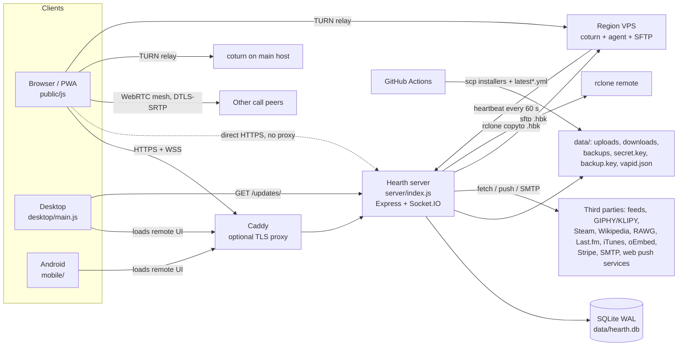
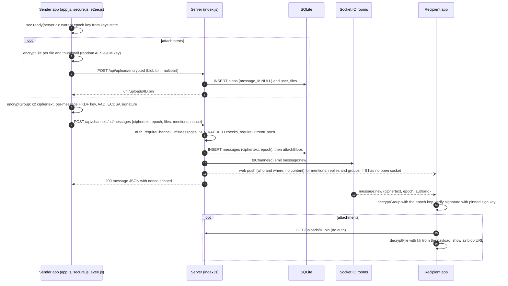

# Hearth architecture overview

Hearth 1.27.1 is a self-hosted chat app with end-to-end encrypted (E2EE) messages and files. One Node process runs
everything: the HTTP API, Socket.IO, voice signaling, background jobs and backups. It stores data in one SQLite file.
Paths are relative to `hearth/`, except `.github/`, which is at the repository root. Line numbers appear only in
section 7, as requested. Everything else is cited by file and function name.

## 1. Components and entry points

| Component | Entry point | What it is |
|---|---|---|
| Server | `server/index.js` | Express 4 app plus an `api` router mounted at `/api`. Socket.IO 4 is set up in `setupSockets`. An async block at the bottom starts HTTP or HTTPS (`loadTls` makes a self-signed cert if `SSL_CERT` is unset). Feature modules get a shared context object: `accounts.js` (email, 2FA, recovery, reset), `newsbot.js` (feeds, trackers), `study.js` (Recall sync), `activity.js` (games and music), `regions.js` (relays), `money.js` (Ko-fi and Stripe supporter badge), `memberships.js` (Stripe Connect tiers). Support code lives in `db.js`, `perms.js`, `profile.js`, `page.js` and `backup.js`. `cli.js` is an operator CLI for TURN settings and backups. |
| Web client | `public/index.html` | Loads `/socket.io/socket.io.js` and `public/js/app.js` as ES modules. There is no build step. Main modules: `api.js` (REST calls with a bearer token), `e2ee.js` (crypto primitives), `secure.js` (key manager), `voice.js`, `relays.js`, `watch.js` (calls), `recall-host.js` plus `public/recall/` (study app in a sandboxed iframe), and `sw.js` (service worker, push, offline shell). |
| Desktop | `desktop/main.js` | Electron app. The local `connect.html` picks a server. Then the `BrowserWindow` (`contextIsolation`, `sandbox`) loads the remote server origin. `preload.js` exposes `window.hearthDesktop`. `detect.js` detects games and music, and `hotkeys.js` provides global push-to-talk. Updates come through `electron-updater`. |
| Android | `mobile/` | Capacitor 8 shell. `www/index.html` is the connect page, and then the WebView loads the remote server. `native/MainActivity.java` keeps navigation on that origin, prompts on certificate fingerprints, and runs the `HearthAndroid` bridge (notifications, file saving, server switching). The page side is `public/js/android.js`. |
| Relays / regions | `server/regions.js` | An admin adds a region and gets a `curl … \| sudo bash` command for `/regions/install/:id?k=`. The script installs coturn with the instance TURN secret, an upload-only SFTP account for backups, and an agent. A systemd timer runs the agent every minute to POST `/api/regions/:id/heartbeat`. |
| TURN | `scripts/setup-turn.sh`, `deploy/turnserver.conf` | coturn. `setup-turn.sh` uses `use-auth-secret` and `denied-peer-ip` for private ranges. `turnserver.conf` is a static-password sample. The server issues credentials in `iceServersFor`. |
| Caddy | `deploy/Caddyfile` | Optional reverse proxy (compose profile `domain`). It terminates TLS and does `reverse_proxy hearth:3000`. It sets no request size limit. |
| Hosting | `Dockerfile`, `docker-compose.yml`, `deploy/hearth.service`, `scripts/harden-vps.sh` | Docker, or systemd on a VPS. |



## 2. Request and real-time flow

**Middleware order** (as registered in `server/index.js`):

1. `app.set('trust proxy', TRUST_PROXY)`. The default is `loopback, linklocal, uniquelocal`, so `X-Forwarded-For` is honoured only when the TCP peer is a private address. `socketIp` does the same for Socket.IO.
2. `directGuard`. When `HTTPS=false` and `ALLOW_DIRECT_HTTP` is not `true`, requests from public peer addresses get a 403. The same check is Socket.IO's `allowRequest`.
3. `express.json({ limit: '2mb' })`. It keeps the raw body for `/api/pay/*`, so webhook signatures can be checked.
4. Security headers on every response: nosniff, `X-Frame-Options: DENY`, COOP, Permissions-Policy, and HSTS when the request is secure. `cspFor` sets the CSP on everything except `/uploads/` and `/media/`. `/api/` responses get `no-store` and CORP.
5. File routes: `/uploads/:file`, `/manifest.webmanifest`, `/sw.js`, `/download`, `/terms`, `/updates/:file`, `/downloads/:file`.
6. The CSP middleware for `/recall`, then an in-memory brotli/gzip handler for text assets, `express.static(public/)` and `/vendor/argon2.js`.
7. `app.use('/api', api)`. Inside the router: a gzip wrapper on `res.json` for bodies of 4 KB or more, an IP-ban guard on `/auth/register` and `/auth/login`, then the routes. **There is no router-wide auth.** Each route lists the `auth` middleware itself, and staff routes add `staffOnly`, `adminOnly` or `ownerOnly`.
8. App-level routes registered later in the file: `/media/gif` (index.js), `/media/news` (newsbot.js), `/media/art` and `/media/game` (activity.js), `/regions/install/:id` (regions.js).
9. `api` 404 JSON handler, then the error handler, then the SPA fallback for GETs outside `/api`, `/uploads` and `/socket.io`. The error handler returns `HttpError` messages to the client. For any other error it calls `console.error(err)` and returns a generic message.

**Auth.** The client fetches its KDF salt from `GET /api/auth/params`. `deriveKeys` in `e2ee.js` runs Argon2id and then HKDF. The result is an `authKey`, which is sent, and a `wrapKey`, which never leaves the device. The client solves a proof-of-work captcha (`GET /api/captcha`, `public/js/captcha-worker.js`). `POST /api/auth/login` then runs these steps in order:
- the rate-limit counters
- `verifyCaptcha`
- a bcrypt compare (against `DUMMY_HASH` when the user is unknown)
- `require2fa` in `accounts.js`
- `createSession`

The session token is 32 random bytes, returned once. The DB stores only its SHA-256 (`sessions.token_hash`). The client keeps the token in `localStorage['hearth.token']` and sends `Authorization: Bearer`. No cookies are used.

The `auth` middleware calls `sessionFor`, which accepts a 64-hex token whose session is not revoked, not past `expires_at` (default 365 days) and not idle for more than 60 days. It then rejects deleted users (401), suspended users (403) and non-staff during maintenance (503). On success it sets `req.userId` and `req.session`, touches `last_used_at` at most once a minute, and records the IP. `stepUp` re-checks the `authKey`, and the 2FA code if 2FA was not passed in the last 10 minutes. It guards password, username, email and recovery-key changes, account deletion and viewing the backup key.

**Authorization.** `server/perms.js` defines 17 permission bits plus ADMINISTRATOR. `perms.base` gives server-level permissions and `perms.channel` applies channel overrides. The route helpers are `requireServer`, `requireChannel`, `requirePerm`, `requireOwner` and `requireDm`. Routes keyed by a channel, message, role or event ID load that row and check membership against its own `server_id`. Instance staff come from `staffRole` and `ownerId`: the owner setting, then names listed in `ADMIN_USERS`, then the `staffRoles` setting.

**Rate limiting.** `rateLimit`, `countHit` and `limitNet` in `server/index.js` use an in-memory `Map` with fixed windows. Keys combine the user, the session, the network (IPv4 address or IPv6 /64) and a global key. The counters reset on restart and are not shared between processes. Examples:
- `limitMessages`: 30 per 10 s per user, 1500 per hour per user, 25 per 10 s per session, 120 per 10 s per network.
- Uploads (`limited`): 60 per minute per user, 600 per hour per user, 40 per minute per session, 150 per minute per network.
- Login and registration: per-network and global counters (plus per-account for login), checked before the captcha.

**Socket.IO.** Options: `pingInterval` 10 s, `maxHttpBufferSize` 1 MB, `allowRequest` = `directGuard`.
- *Handshake* (`io.use`): `handshake.auth.token` goes through `sessionFor`. The user must not be deleted or suspended. The IP must not be banned and maintenance must be off (staff are exempt from both). The middleware stores `socket.data.sid`.
- *On connect*: each socket gets a flood bucket of 40 events, refilled at 10 per second. After 50 refusals the socket is disconnected. The socket joins `user:<uid>`, `admins` (staff only) and `server:<sid>` for each membership. Presence is broadcast.
- *Per event*: `guard(fn)` wraps every handler. It acks `{ok:true}` or `{error}`. Each handler runs its own checks (`requireChannel`, `requireDm`, voice-room membership).
- Client-to-server events are `typing`, `voice:*`, `call:decline` and `watch:*`. Everything else goes over REST, and the server pushes the resulting events (`message:new`, `dm:message`, `keys:state`, `voice:state` and others).
- *Revocation*: `revokeSessions` disconnects the matching sockets. A 60-second sweep closes sockets whose session has ended. The client calls `logout()` when the server disconnects it.

**Sending a channel message.** On the client this starts in `sendTo` (`public/js/app.js`). On the server it is `POST /channels/:id/messages` (`server/index.js`).



`toChannel` emits to `server:<sid>`. For a restricted channel it emits only to the `user:<uid>` rooms of members who have VIEW. DMs follow the same pattern: `encryptDm` builds a `d2:` ciphertext, the client calls `POST /api/dms/:id/messages`, and the server emits `dm:message` to the two `user:` rooms.

## 3. Data model overview

`server/db.js` opens one `better-sqlite3` connection in WAL mode with `foreign_keys=ON`. All queries run synchronously on the event loop. The schema version is `PRAGMA user_version` = 16. Tables use `CREATE TABLE IF NOT EXISTS` plus `addColumn`, and some data migrations are gated on the version. Users are soft-deleted (`deleted_at`).

| Area | Tables | Ciphertext / sealed / hashed | Plaintext metadata |
|---|---|---|---|
| Accounts | `users` | `enc_private_key`, `enc_private_key_recovery`, `enc_sign_private_key` (encrypted client-side). `auth_hash` = bcrypt(authKey). `totp_secret` sealed with `secret.key`. Backup codes are HMACs. | username, email, profile/page JSON, privacy, public and signing keys, `last_ip`, `last_seen_at`, activity, supporter fields |
| Sessions | `sessions`, `auth_tokens`, `user_ips`, `push_subs` | session token and reset token stored as SHA-256 | user agent, IPs, timestamps, push endpoint and keys |
| Structure | `servers`, `channels`, `members`, `roles`, `member_roles`, `channel_overrides`, `invites`, `bans`, `emojis` | none | names, topics, themes, permissions, membership |
| Messages | `messages`, `dm_messages`, `dm_channels`, `reactions`, `poll_votes`, `poll_closed` | `messages.ciphertext` (`c2:`), `dm_messages.ciphertext` (`d2:`). Legacy pre-E2EE and news-bot bodies are in `messages.body`, sealed with `secret.key`. | author, channel/DM, `epoch`, `reply_to`, `thread_id`, timestamps, pins, reaction emoji, poll choice indexes |
| Group keys | `server_epochs`, `server_keys` | `server_keys.wrapped` (`w1:`, ECIES per member). `key_check` is a truncated hash. | epoch numbers, who wrapped for whom |
| Files | `blobs`, `user_files`, `gif_library` | `.bin` contents on disk | names, sizes, uploader, linked message |
| Recall | `study_items` | `data` (`x1:` vault ciphertext) | kind, size, timestamps |
| Events / feeds | `server_events`, `event_rsvps`, `feeds`, `feed_seen`, `user_feeds`, `user_feed_items` | none | everything |
| Moderation | `reports`, `staff_notes`, `admin_log` | none | Report evidence is the plaintext the reporter submits, plus the target's IPs. `admin_log` is append-only (triggers) with a SHA-256 hash chain. |
| Money | `payments`, `creator_accounts`, `membership_tiers`, `memberships` | none | Stripe IDs, amounts, statuses |
| Instance | `instance_settings`, `regions`, `game_catalog`, `profile_comments` | The SMTP password and the memberships Stripe secret key are sealed. | Other settings, such as the TURN secret, GIF/Last.fm/RAWG keys and the payments config, are plain JSON. |

Server-side key files live in `data/`. `secret.key` (or the `AT_REST_KEY` env var) is the AES-256-GCM key for `seal`/`unseal`, and it also keys the HMACs (media tokens, captcha challenges, fake KDF salts, 2FA backup codes). The others are `backup.key` (or `BACKUP_KEY`), `vapid.json`, and `region-backup/id_ed25519`.

## 4. Encryption architecture and key ownership

All E2EE runs in the browser through WebCrypto (`public/js/e2ee.js`). `public/js/secure.js` manages the keys for each session.

| Key | Made by | Where it lives | Protection |
|---|---|---|---|
| Password master | Argon2id (64 MiB, 3 passes, 16-byte random salt). Legacy accounts use PBKDF2 and are upgraded at their next login. | never stored | - |
| `authKey` / `wrapKey` | HKDF(master, `hearth-auth-v2` / `hearth-wrap-v2`) | The server stores bcrypt(authKey). `wrapKey` stays in browser memory. | - |
| Identity key (ECDH P-256) | `createIdentity`, at registration or on a reset without recovery | `users.enc_private_key`. The unwrapped key is stored non-extractable in IndexedDB `hearth/keys`. | AES-GCM under `wrapKey` |
| Signing key (ECDSA P-256) | `createSigningKey`, uploaded once via `/me/sign-key` | `users.sign_public_key`, `enc_sign_private_key` | HKDF(ECDH(id, id)) "self key" |
| Server group key | 32 random bytes per epoch, generated by a member's client (`secure.js` `rotate`) | `server_keys` (one wrap per member), `server_epochs.key_check` | `wrapGroupKey`: ephemeral ECDH to the recipient, HKDF, AES-GCM. Context `hearth-gk\|server\|epoch\|recipient\|wrapper` is both HKDF info and AAD. Signed by the wrapper. |
| Channel message key | HKDF(group key, random 32-byte salt, `hearth-msg-v2\|channelId`) | not stored | Format `c2:<epoch>:<salt>:<iv>:<ct>:<sig>`. AAD `hearth-c2\|channelId\|epoch\|authorId`. ECDSA-signed. Plaintext padded (`padded`). |
| DM message key | HKDF(ECDH(me, peer), random salt, `hearth-dm-v2\|dmId`) | not stored | Format `d2:<salt>:<iv>:<ct>`. AAD binds the DM and the author. Not signed. |
| File key | random 256-bit key per file and per thumbnail (`encryptFile`) | inside the encrypted message payload (`f[].k`) | blob = iv‖ct, uploaded as `.bin` |
| Recovery key | 32 base32 characters (160 bits) from `newRecoveryCode` | Shown once to the user. The server holds only the rewrapped identity key (`PUT /me/recovery`, behind step-up). | HKDF(code, `recovery_salt`) + AES-GCM |
| Recall vault key | HKDF(ECDH(id, id)) | not stored | `x1:` AES-GCM, AAD `hearth-vault\|kind\|id` |
| At-rest key | `data/secret.key` | server | used for `seal()`: legacy messages, news-bot posts, TOTP secrets, SMTP password, Stripe key |
| Backup key | `data/backup.key` or `BACKUP_KEY` | server | see section 11 |

**Group key lifecycle.** The server sends each member `keys:state` (from `keyState`): the current epoch, `needsRotation`, the member's own wraps and the list of members who still need the key. `secure.js` `applyState` checks each wrap's signature against the wrapper's signing key and the `key_check`, then unwraps it.
- `POST /servers/:id/keys/rotate` requires `epoch = current + 1` and a wrap for every current member. It runs in a transaction.
- `POST /servers/:id/keys/share` adds wraps of the current epoch for members who lack it. The sharer must hold the current epoch.
- `POST /servers/:id/keys/bad` deletes the caller's own wrap when it cannot be unwrapped.
- `removeMember` (leave, kick, ban) sets `needs_rotation`. Until some member's client rotates, sends and edits return 409. Joining does not rotate: new members receive the current epoch.
- Group DMs are servers with `kind='group'` and use the same group keys.

**Identity trust.** Each device pins other users' keys on first sight, in `localStorage` (`checkPin` / `acceptPin`). A changed key pauses DM sending and key sharing with that user. The safety number is a 60-digit SHA-512 over both users' keys. Account reset (`accounts.js`) works one of two ways. With the recovery key plus an ECDH proof (`resetKeyProof`), the identity key is kept. Without it, a new identity is created and the user's own `server_keys` rows are deleted.

**What the server can and cannot read** (assuming it serves the shipped client JS):
- **Cannot read:** channel, group and DM message text; attachment contents, file names and types; poll questions and options; Recall items; voice and video media; passwords; recovery keys; private keys; group keys.
- **Can read:** usernames, emails, profiles and profile pages, avatars and other public media, IPs, user agents, session metadata, membership, roles, channel names and topics, who posted where and when, reply and thread structure, pins, reaction emoji, poll vote indexes, events, the @mention user IDs the client sends for push, attachment counts and sizes, presence, game and music activity, call participation, watch-together URLs, report evidence submitted by reporters, and push endpoints.
- **Can read with `secret.key`:** legacy pre-E2EE messages, news-bot posts, TOTP secrets, the SMTP password and the Stripe secret key.
- All three clients run JavaScript served by the server, and the E2EE keys are derived in that JavaScript (SECURITY.md describes this).
- Private channels use the same server group key as the rest of the server. The server controls who receives their events (`toChannel`).

## 5. Voice and video

- **Mesh.** `public/js/voice.js` builds a full-mesh WebRTC call. A newcomer is the initiator toward every existing peer. Each peer connection has four fixed transceivers (mic, camera, screen, screen audio), switched with `replaceTrack`. Media is DTLS-SRTP between browsers.
- **Signaling** goes through Socket.IO.
  - `voice:join` checks one of two cases. For a DM call, the user must be a participant and not blocked. For a channel, `requireChannel`, `type === 'voice'` and CONNECT must pass.
  - It returns the peers' socket IDs and rings callees on the first join (`call:ring` plus web push).
  - `voice:signal` relays `data` only to a socket in the same room, and the server sets `from`/`userId` itself.
  - SDP offers and answers are ECDSA-signed over `hearth-voice|room|from|to|type|sdp`. The receiver verifies them against the sender's TOFU-pinned signing key (`secure.js` `verifySdp`). ICE candidates are unsigned.
  - Call state (`voiceChannels`, `userVoice`, `watchRooms`) lives in memory and is lost on restart.
- **ICE / TURN.** STUN defaults to Google's servers (`STUN_URLS`). `iceServersFor` adds the main relay (the `turnUrls` setting or `TURN_URL`) and every region seen in the last 3 minutes (`REG.liveRelays`).
  - With a TURN secret set, credentials follow the coturn REST scheme: username `<expiry>:<uid>`, credential base64 HMAC-SHA1(secret, username). They are valid for 12 hours, and the same credential works on every relay.
  - Without a secret, the static `TURN_USERNAME` / `TURN_CREDENTIAL` are used.
  - The list is delivered in `/api/bootstrap` (and `/api/ice`).
- **Regions.** `relays.js` `rankRelays` measures each relay and caches the result for 6 hours. `chooseIce` uses STUN plus the two fastest relays. `POST /api/calls/region` pins a call to one region (`channels.rtc_region` / `dm_channels.rtc_region`), which forces `iceTransportPolicy: 'relay'`. In a server channel this needs Manage Channels. In a DM or group, any participant can do it.
- **Watch together.** The server keeps the shared player state and rebroadcasts it to `voice:<room>`. It fetches YouTube or Vimeo oEmbed titles.
- **What each party sees.**
  - A relay sees encrypted SRTP, packet sizes and timing, peer IPs, and the TURN username (which contains the user ID).
  - A region VPS also holds the instance-wide TURN secret and stores encrypted `.hbk` backups.
  - The Hearth server sees who is in each call, the mute, video and screen flags, and all signaling, including the SDP and the ICE candidates with their IPs.
  - In a direct (non-relayed) connection, peers see each other's IPs.

## 6. Files and uploads

- **Storage.** Uploads go into a flat `data/uploads/`. File names are generated (`newId` + 6 random bytes + a safe extension). Encrypted blobs always get `.bin`. Other folders are `data/cache/art` (activity picture cache, pruned to 400 MB), `data/downloads` (installers and the update feed) and `data/backups`.
- **Upload pipeline.** All uploads are multipart through multer, behind `auth` and `limited(kind, …)`. `limited` applies the rate limits, then `quotaOf`: blocked flag, per-file cap, total quota and daily allowance (instance admins are exempt from quota and daily). It records the file in `user_files` and deletes it again if the response status is 400 or higher. Route-level permission checks run after the upload.
- **Kinds.**
  - `/upload/encrypted`: attachments, no type filter. It creates a `blobs` row with `message_id` NULL.
  - Image routes (avatar, banner, background, page background, server icon and media, emoji): filtered on extension plus the declared `image/*` type.
  - `/me/song`: audio.
  - `/gifs/library`: buffered in memory (multer `memoryStorage`), then written to `uploads/` and `gif_library`. Not recorded in `user_files`.
  - Two server-side downloads: emoji from GIPHY, and GIF "learn".
- **Linking and cleanup.** `attachBlobs` links blobs to a new message only if the sender uploaded them and they are not yet linked. An hourly sweep deletes blobs still unlinked after 24 hours. `removeMessageFiles` runs on message, channel and server deletes.
- **Serving.**
  - `GET /uploads/:file` needs no auth. It checks the name against a regex and takes the content type from an extension whitelist; anything else is sent as an `octet-stream` attachment. It sets a sandbox CSP and immutable caching.
  - `/media/gif`, `/media/art` and `/media/news` are proxies. They need a 7-day per-user HMAC media token (`mediaToken`, sent in bootstrap).
  - `/media/game/:id` is public for catalogued games.
- **Non-E2EE media** (avatars, banners, icons, emoji, songs, the GIF library) is stored as uploaded and readable by anyone who has the URL. The server never decodes images. The client (`public/js/media.js`) resizes and re-encodes images before encrypting them.

## 7. Background jobs and timers

All of these run inside the single server process. Their state is in memory or SQLite, and nothing coordinates them across processes.

| Job | Location | Interval | What it does |
|---|---|---|---|
| Rate-limit sweep | `server/index.js:96` | 60 s | Drops expired buckets. |
| Orphan blob cleanup | `server/index.js:565` | 1 h | Deletes `.bin` blobs never attached to a message after 24 h. |
| Session purge | `server/index.js:772` | 1 h | Deletes sessions revoked or expired more than 30 days ago. |
| Presence flush | `server/index.js:1160` | 1 s debounce | Batches presence broadcasts. |
| Captcha sweep | `server/index.js:2799` | 60 s | Clears used-captcha and failure maps. |
| Page-view dedupe sweep | `server/index.js:3319` | 10 min | Clears the profile view-count map. |
| Event reminders | `server/index.js:3498` | 60 s | 15 min before an event: `event:starting` socket event and web push to RSVPs marked going or maybe. |
| Daily backups | `server/index.js:3774` | hourly check | If the last backup is more than 23.5 h old: plain DB copy, then encrypted backup (section 11). |
| Socket session sweep | `server/index.js:3942` | 60 s | Disconnects sockets of dead sessions and touches `last_used_at` for live ones. |
| Socket flood refill | `server/index.js:3978` | 1 s per socket | Refills the event bucket. |
| Shutdown | `server/index.js:4196`, `4203` | on SIGTERM/SIGINT | Emits `server:restarting`, closes after 250 ms (WAL checkpoint and close), hard exit at 4 s. |
| Reset/email token purge | `server/accounts.js:135` | 1 h | Deletes expired `auth_tokens`. |
| Art cache prune | `server/activity.js:125`, `126` | 30 s after start, then 1 h | Keeps `data/cache/art` under 80% of the cap. |
| Activity broadcast | `server/activity.js:272` | 800 ms debounce | Batches `user:activity` events. |
| Activity expiry | `server/activity.js:324` | 30 s | Clears stale game and music status. |
| Last.fm polling | `server/activity.js:489` | 10 s loop | "Now playing" for opted-in online users, each user at most every 30 s or more. |
| News bot + trackers | `server/newsbot.js:320`, `321` | 60 s (first run at 20 s) | `tick`: server feeds due every 10 min (`EVERY_MS`), 20 per tick. `userTick`: personal trackers due every 30 min, 30 per tick. |
| Feed parse timeout | `server/newsbot.js:194` | per parse, 5 s | Kills the feed-parser worker thread if a parse runs too long. |
| Supporter expiry | `server/money.js:81`, `82` | 1 h (first run at 20 s) | Removes the supporter flag once `supporter_until` has passed. |
| Membership reconcile | `server/memberships.js:391` | 1 h | Re-reads overdue Stripe subscriptions (up to 50). |

Outside the server process:
- Region agent: a systemd timer runs it every 60 s on each region VPS. The timer is defined in the install script in `server/regions.js`.
- Docker `HEALTHCHECK`: every 30 s.
- Client side: message reminders kept in `localStorage`, checked every 20 s (`public/js/features.js`).
- Client side: a service-worker update check every 30 min (`public/js/app.js`).
- Desktop: an update check 15 s after start and then every 4 h (`desktop/main.js`).

## 8. Outbound requests

Every place the server process makes a network request:

| Caller | File / function | Target | Guard |
|---|---|---|---|
| Server feeds, personal trackers, YouTube handle lookup, `/media/news` | `server/newsbot.js` `safeGet` | Google News, Reddit, Steam, GitHub, YouTube, or any http(s) URL (`rss` kind) | `assertPublic` (DNS lookup, blocks private IPs), manual redirects re-checked (5 hops), 3 MB (8 MB for images), 12 s timeout, parsing in a worker |
| Game/music search and lookups | `server/activity.js` `getJson` | Steam store, Wikipedia, RAWG, Last.fm, iTunes; Spotify, YouTube and SoundCloud oEmbed | fixed hosts (env-overridable bases), 8 s timeout |
| Music link pages | `server/activity.js` `getText` via `safeFetch` | music.apple.com, bandcamp.com | https + host allow-list on every hop, 400 KB cap |
| Art proxy and cache | `server/activity.js` `fetchImage` via `safeFetch` | `ART_HOSTS` (+ `ART_PROXY_EXTRA_HOSTS`) | host allow-list on every hop, 10 s, 6 MB |
| GIF search | `server/index.js` `gifFetch` | `api.giphy.com` / `api.klipy.com` (`GIPHY_API_BASE`, `KLIPY_API_BASE`) | 8 s timeout |
| GIF media proxy | `server/index.js` `/media/gif` | `MEDIA_HOSTS` (+ `GIF_PROXY_EXTRA_HOSTS`) | host allow-list, media token, 15 s, 20 MB by `Content-Length`, streamed |
| Emoji from GIPHY | `server/index.js` `/servers/:id/emojis/from-giphy` | `MEDIA_HOSTS` | host allow-list |
| GIF "learn" | `server/index.js` `/gifs/used` | `MEDIA_HOSTS` | host allow-list, 15 s, 8 MB |
| Watch-together title | `server/index.js` `watchTitle` | youtube.com / vimeo.com oEmbed | 4 s timeout |
| Stripe API | `server/memberships.js` `stripe()` | `api.stripe.com` (`STRIPE_API_BASE`) | 15 s timeout |
| Web push | `server/index.js` `pushTo` → `web-push` | endpoint URL given by the user's browser (`/push/subscribe`, must start with `https://`) | none beyond the URL check |
| Email | `server/accounts.js` `sendMail` → nodemailer | the configured SMTP host | 15 s connect and greeting timeouts |
| Off-site backup | `server/backup.js` `uploadOffsite` → `rclone` child process | `BACKUP_RCLONE_REMOTE` | 6 h timeout |
| Region backup | `server/regions.js` `sftpPut` → `sftp` child process | region IP reported by its heartbeat | `StrictHostKeyChecking=yes`, host key pinned per region |

Inbound webhooks (`/api/pay/kofi`, `/api/pay/stripe`, `/api/pay/memberships`) and region heartbeats arrive at the server and make no outbound calls.

## 9. Packaging and updates

**Server.**
- The `Dockerfile` has two stages on `node:22.23-bookworm-slim`. It runs `npm ci --omit=dev`, removes npm from the runtime image, installs `openssh-client` for region backups, and sets a `HEALTHCHECK` on `/api/config`.
- `deploy/docker-entrypoint.sh` drops root to uid 1000.
- `docker-compose.yml` defines three services. `hearth-perms` is a one-shot chown. `hearth` runs read-only with `cap_drop: ALL` and port 3000. `caddy` is under the `domain` profile.
- The alternative is systemd with `deploy/hearth.service`.

**Server updates** are manual. `scripts/hearth-update.sh` (run as root, often uploaded by `tools/update-hearth.sh` or `Update-Hearth.ps1` over SSH) does the following:
1. Accepts an update zip. Its only check on the zip is that it contains `hearth/server/index.js`.
2. Detects how Hearth runs: Docker, systemd, pm2 or plain.
3. Backs up the code and `data/` (without uploads, backups and downloads) to `/root/hearth-backups`, keeping 5.
4. Builds in a staging folder.
5. Rsyncs the new files, skipping `data/`, `.env`, the compose file and the Caddyfile.
6. Restarts Hearth and checks `/api/config`, rolling back automatically on failure.

**Web client.** The server serves the client directly. `/sw.js` is versioned by a hash of the `public/` files. On reconnect the client compares `/api/config` `version` and reloads if it changed.

**Desktop.**
- electron-builder targets Windows NSIS, macOS dmg, and Linux AppImage and deb.
- `electron-updater` uses the generic provider. At runtime its feed URL is set to `<chosen server>/updates/`, which the server serves from `data/downloads`. It sets `autoDownload` and install-on-quit.
- Updating is disabled on macOS and in unpackaged builds.
- `desktop/build/configure-signing.js` picks the Windows signing method: Azure, pfx, SignPath or none. `after-signing.js` rewrites the sha512 in `latest.yml`.

**Android.** The app UI is remote, so it changes whenever the server updates. CI builds the APK. The signing key comes from secrets, or is generated once and kept in the Actions cache. Release builds can be uploaded to Google Play internal testing. Users get the APK from `data/downloads` (the `/download` page) or a GitHub release.

## 10. CI/CD workflows

- **`.github/workflows/hearth-security.yml`**
  - *Triggers:* push to any branch or PR touching `hearth/**` or `.github/**`, a weekly cron, and manual runs.
  - *Settings:* `contents: read`, actions pinned to SHAs, `persist-credentials: false`.
  - *Jobs:* `tests` (`npm ci`, `npm test`); `audit` (`npm audit --omit=dev --audit-level=high`, which fails for the server and only reports for desktop); `secrets` (gitleaks, binary checksum verified); `image` (`docker build`, then Trivy image and config scans); `codeql` (JavaScript, with `security-events: write`).
- **`.github/workflows/hearth-apps.yml`**
  - *Triggers:* push to any branch touching `hearth/desktop/**`, `hearth/mobile/**` or the workflow file; `app-v*` tags; manual runs with an optional `server` input (or the `HEARTH_SERVER` repo variable).
  - *Settings:* workflow-wide `contents: write`.
  - *Jobs:* `desktop` (Windows, macOS and Linux matrix, with signing and SignPath); `android` (builds and signs the APK, optional Google Play upload); `release` (tags only, creates a GitHub release).
  - `publish-to-vps` runs for tags, the default branch and manual runs. It uses `appleboy/scp-action` and `ssh-action` with the `VPS_*` secrets to copy installers and `latest*.yml` into the server's downloads folder and keep the two newest of each.
- **`hearth/.github/workflows/desktop.yml`** does not run in this repository, because GitHub reads only the root `.github/`. It is kept for standalone use (`desktop-v*` tags).
- **`.github/dependabot.yml`**: weekly updates for npm (server, desktop, mobile), GitHub Actions, Docker and docker-compose.
- **Tests:** `npm test` runs `node --test --test-concurrency=1 test/*.test.js`. `test/helpers.js` spawns real server instances in temp data folders.
- No workflow deploys the server itself.

## 11. Backups and restore

```text
hourly timer (server/index.js)
  ├─ makeBackup('auto')     db.backup() → data/backups/hearth-auto-<ts>.db   (plain SQLite, local, keep N)
  └─ makeEncryptedBackup()  backup.js createBackup → verifyBackup → uploadOffsite (rclone) → regions copyBackup (sftp)
```

- **Encrypted backup** (`server/backup.js` `createBackup`):
  1. `db.backup()` takes a consistent snapshot to `data/backups/encrypted/.snapshot-<ts>.db`.
  2. The snapshot, `secret.key`, `vapid.json` and every file in `uploads/` are streamed into `hearth-<ts>.hbk.part`.
  3. Encryption is AES-256-GCM in 1 MiB chunks. The key is HKDF-SHA256(backup key, 32-byte random salt). Each nonce is a 7-byte random prefix, a u32 counter and a last-chunk flag. The header is the AAD.
  4. The `.part` file is renamed to `.hbk` and the snapshot is deleted.
  5. `verifyBackup` decrypts into `data/backups/.verify-*`, runs `PRAGMA integrity_check` and counts rows.
  6. Copies go to `BACKUP_RCLONE_REMOTE`, if set, and to each live region with backup space. A region keeps `REGION_BACKUP_KEEP` copies (default 14).
  7. Local `.hbk` files are pruned to `max(2, keep)`. Status goes into the `backupStatus` setting. Failures go to `console.error` and the audit log.
- **Not inside an `.hbk`:** `backup.key`, the TLS cert and key, the region SSH key, `data/downloads`.
- **Policy:** the `autoBackup` setting (default on, keep 7).
- **Manual (owner only):** `POST /api/admin/backups` (6 per hour), plus verify, download (`.hbk` only) and delete. `POST /api/admin/backups/key` shows the key after step-up, unless `BACKUP_KEY` is set in the environment.
- **CLI:** `node server/cli.js backup | verify-backup FILE [KEY] | restore FILE NEW_DATA_DIR [KEY]`. `restore` requires an empty target folder. You then point `DATA_DIR` at it.
- **Other copies:**
  - `db.js` copies `hearth.db` to `data/backups/hearth-before-v16-<ts>.db` before migrating an older schema.
  - `hearth-update.sh` keeps 5 code-and-data snapshots in `/root/hearth-backups` for `--rollback`.
  - The Docker image has no rclone. The docs say to run rclone on the host over `data/backups/encrypted/`.

## 12. Logging and monitoring today

- **Process output.** The server has about 29 `console.*` calls: 16 in `index.js`, 10 in `cli.js`, 2 in `memberships.js` and 1 in `db.js`. They cover the startup banner, unexpected 500 errors, backup failures, push setup and migration copies.
  - There is no access log, no structured logger and no log levels.
  - Docker keeps output in the json-file driver, rotated at 3 × 10 MB. systemd sends it to the journal. `hearth-update.sh --logs` shows the last 80 lines.
  - Caddy's access log is commented out by default. When enabled, it strips query strings.
- **Security log.** `secEvent` keeps an in-memory ring of the last 500 events: failed logins, captcha failures, blocked IPs, step-up and 2FA failures, 2FA changes, resets and username changes. `GET /api/admin/security` shows recent events and the top failing IPs. The log is lost on restart.
- **Audit log.** The `admin_log` table, written by `auditLog`, is append-only through triggers and carries a SHA-256 hash chain. `GET /api/admin/log` and `/api/admin/log/verify` show it to staff. Backup results are recorded there too.
- **Health.** `GET /api/admin/stats` (staff) includes a 14-day activity series and `health()`: CPU count, load, memory, RSS, free disk, socket count, p99 event-loop lag (`monitorEventLoopDelay`) and uptime. The unauthenticated `GET /api/config` is the liveness probe for Docker and `hearth-update.sh`. Region load and traffic come from the heartbeats (Admin → Regions), and backup status appears under Admin → Owner. New reports reach staff live as `admin:report` on the `admins` room.
- There is no metrics export, external monitoring or alerting integration.
