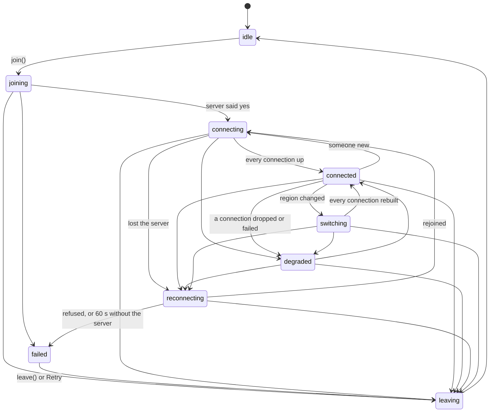

# Voice and video

How Hearth calls work, how they recover when something breaks, and what each party can and can't see. Paths are
relative to `hearth/`. The call engine is `public/js/voice.js`; the call UI is in `public/js/app.js` (search for
`callStage`, `renderVoicePanel`, `applyCallRegion`) and `public/js/call-diagnostics.js`; the server side is the
`voice:*` socket handlers near the end of `server/index.js`, plus `/api/ice`, `/api/calls/region` and
`server/regions.js`.

## 1. Architecture

### Mesh

A call is a full mesh: every participant has one `RTCPeerConnection` to every other participant. There is no
media server. Audio and video go straight from browser to browser (or through a TURN relay when a network blocks
direct paths), encrypted with DTLS-SRTP by the browser. Mesh suits small rooms: voice up to about 8–10 people,
video up to about 4–6.

Every connection negotiates four transceivers up front, always in this order: 0 microphone, 1 camera, 2 screen,
3 screen audio. Turning the camera or a share on or off, or switching microphones, plugs a track into its lane
with `replaceTrack`. No renegotiation is ever needed for that, so two people toggling video at once can't collide.

### Signaling

Signaling goes over the app's Socket.IO connection.

| Event | Direction | What it does |
|---|---|---|
| `voice:join { channelId, muted, deafened, video, resume? }` | client → server | Access checks (DM: participant and not blocked; channel: `requireChannel`, voice type, CONNECT). Answers `{ peers: [{ userId, socketId, reconnecting }], canSpeak, region, regionVersion, resumed? }`. |
| `voice:peer-joined { userId, socketId, resumed }` | server → room | Someone (re)joined. Anyone still connected to them from before moves that connection to the new socket. |
| `voice:signal { to, data }` | client → server → peer | Relayed only between two sockets in the same room; the server sets `from` and `userId` itself. `data` carries an SDP (signed), an ICE candidate, or a restart/reset request, plus the connection ids `pc`/`topc` (below). |
| `voice:update` | client → server | Mute, deafen, video, screen flags. |
| `voice:state { channelId, users }` | server → viewers | Who is in the call, with flags and `reconnecting`. |
| `voice:peer-left`, `voice:kicked`, `voice:perms` | server → clients | Someone left; you were removed; your Speak permission changed. |
| `voice:leave` | client → server | Hang up (also accepted for a place kept after a dropped connection, from the same session). |
| `call:region { room, region, version, by }` | server → room | The call's region changed (section 3). |

The newcomer is the initiator toward every existing member. Offers and answers are signed (section 6).
Candidates from one sender are handled strictly in order, and our own candidates are held back until our offer or
answer has gone out, so the other side never gets a candidate before the description it belongs to.

Each `RTCPeerConnection` has a random id. Every signal says which of the sender's connections it comes from (`pc`)
and which of the receiver's it is for (`topc`). A signal for a connection that has since been replaced is ignored.
An offer from a connection id the receiver hasn't seen before, with no `topc`, means the other side started over,
and it replaces the receiver's connection instead of being applied to it (a browser can't renegotiate onto a new
DTLS fingerprint). When both sides start a fresh connection at the same moment, the side with the lower user id
gives way.

### Relays (TURN) and regions

- STUN defaults to Google's servers (`STUN_URLS`). `iceServersFor` adds the main relay (`turnUrls` setting or
  `TURN_URL`) and every region with a heartbeat in the last 3 minutes (`REG.liveRelays`).
- With a TURN secret, credentials follow the coturn REST scheme (`<expiry>:<pseudonym>`, HMAC-SHA1), 12–18 hours, the
  same login on every relay. They arrive in `/api/bootstrap` and `/api/ice`; the app refreshes them before a call
  when they're within an hour of expiring.
- `relays.js` measures each relay (time to get a relay candidate) and caches it for 6 hours. Automatic mode uses
  STUN plus the two fastest relays.
- A call can be pinned to one region (`POST /api/calls/region`; Manage Channels in a server, anyone in a DM or
  group). A pinned call uses that region's relay only (`iceTransportPolicy: 'relay'`).

## 2. The call state machine

`Voice.state` is the one source of truth; the call bar (`#voice-panel [data-call-state]`) and the call stage head
read `voice.status()`, which derives its label from it.

The exact table is `TRANSITIONS` in `voice.js`; any other change is refused and logged, never applied.

- **Truthful status.** `connecting`, `connected` and `degraded` are worked out from the real connections
  (`recompute`): `connected` only when every `RTCPeerConnection` reports `connectionState === 'connected'` (or
  you're alone). While one connection is being swapped for another, the state isn't recomputed, so an empty
  moment never reads as connected. `reconnecting` says that audio may still be flowing (it usually is: the media
  path doesn't depend on the server).
- **One join at a time.** `join()` while a join is running returns the same promise.
- **Attempt token.** Every join, rejoin, leave and failure bumps `attempt`. Anything that finishes later (a join
  answer, a retry timer, a microphone that opened after you left) checks the token and does nothing if it
  changed, so a stale attempt can never revive a call.
- **Closed connections.** Closing an `RTCPeerConnection` leaves operations still in flight on it (an offer being
  made, say) unsettled forever in Chromium. Every operation on a connection is raced against its closing, so a
  leave in the middle of setting up can't strand a join. (The browser harness found this one.)
- **Cleanup.** `cleanup()` (leave, kick) and `fail()` close every connection, stop every track, and clear every
  timer; `cleanup()` also removes every listener (`devicechange`, `online`, `offline`, `visibilitychange`,
  permission watchers, the 2-second housekeeping timer). `failed` keeps the call bar with the reason and a
  Retry button, but the microphone is released.

## 3. Recovery

### Server grace window and resume

A dropped Socket.IO connection no longer ends the call:

1. The server marks the member `reconnecting` (others see "Reconnecting…" on their tile) and keeps the place for
   `VOICE_GRACE_MS` (default 18 s, clamped to 1–60 s).
2. The app's engine goes to `reconnecting`. When Socket.IO is back, it sends `voice:join { resume: true }`.
3. The server resumes the place only for the **same session** (`socket.data.sid`) that held it, after running the
   same access checks as a fresh join. The other members get `voice:peer-joined` with the new socket id and move
   their existing connection to it.
4. Connections that stayed up are kept as they are (the same `RTCPeerConnection`: no renegotiation, no gap).
   Broken ones are rebuilt by the rejoining side, unless the other person is also reconnecting (then they do it).
5. If the server says no (permission lost, say), the call goes to `failed` with the server's reason. A timeout or
   "Slow down." is retried after 0.5 s, 1 s, 2 s… (doubling, at most 10 s, ±30% jitter), up to 8 times. After 60 s
   without the server the call fails, with Retry.

A different session (another device, or a signed-in-again browser) never resumes: it joins fresh, and the kept
place ends. Signing a session out (`revokeSessions`: sign-out, password change, staff action) ends any place kept
for it at once. `voice:leave` from the same session ends a kept place too. A resume when the server has no kept
place (it restarted) is a fresh join that doesn't ring anyone again.

### Server restart

The server forgets calls on restart. Each app reconnects and rejoins with `resume: true`, which becomes a fresh
join. A connection to someone who hasn't come back yet is kept for 20 s (`UNLISTED_GRACE`) from the moment the
server stopped listing them; in the browser harness the media connection survived a restart untouched.

### Per-connection recovery

One `RTCPeerConnection` that doesn't come up within 12 s, or goes `disconnected` (3 s grace, it often heals) or
`failed`:

1. ICE restart (the initiator restarts; the other side asks it to), backing off 1 s, then 2 s (±30%), checking
   10 s after each.
2. Then one fresh connection.
3. Then the tile says "Can't connect" with a **Retry** button (`voice.retryPeer`), and the call shows `degraded`.

While the server connection is down, no restart is attempted (no signal could get through); the rejoin handles it.

### Sleep, wake and network changes

A 2-second housekeeping timer notices a gap of more than 15 s (the machine slept). Waking up, the `online` event and
the tab becoming visible all run a health check: reconnect to the server immediately (cutting short Socket.IO's own
back-off), and give broken connections an immediate restart. A call in `failed` is retried automatically once the
server is reachable.

### Relay unavailability

- A pinned region that is offline (no recent heartbeat) isn't in the relay list: the app uses automatic relays and
  says "This call's region (…) is offline, so your connection uses automatic relays."
- A pinned region that's listed but whose relay doesn't answer: a relay-only connection that gathers no candidate
  (gathering ends empty, or nothing within 6 s), or that runs out of restarts, switches this app's call to automatic
  relays, rebuilds the connections that weren't up, and says "The call region's relay isn't answering…". The next
  region change gives the region a fresh chance.

### Region switching

- `POST /api/calls/region` bumps a per-room version (`channels.rtc_region_v`, `dm_channels.rtc_region_v`,
  schema v18) in the same `UPDATE … RETURNING`. Concurrent changes are serialized by SQLite: the last write wins,
  and each gets its own version.
- `call:region` carries the version. The app applies a change only if it isn't older than what it has, so every app
  converges on the server's value whatever order the events arrive in. `server:update` (sent after `call:region`)
  carries the same `region` and `regionVersion`.
- The app rebuilds connections when the region **its connections were built with** differs from the new one
  (`S.callNet`), not when the channel object changed, so a channel update that arrives first can't swallow the switch.
- The engine shows `switching` ("Switching region…") until every connection has been **replaced** and is up again
  (or 20 s), on both sides: the side that answered the old connection waits for the fresh offer, it doesn't stop
  at "my old connection is still up". It records the time in `lastSwitchMs`, and the media gap of the last rebuilt
  connection (old one closed → new one connected) in `lastGapMs`; both show in diagnostics. Initiators rebuild
  800 ms after the event so both sides have the new region by then; the old connection carries audio meanwhile.
- A late joiner uses the active region: the `voice:join` answer carries `region` and `regionVersion`.

## 4. Devices

- `devicechange`: if the microphone in use is gone (its device id is no longer listed, or its track ended), the app
  opens the default microphone and swaps it into lane 0 on every connection: no renegotiation. If there's no
  microphone at all, it goes listen-only and says so. A microphone plugged in while listen-only is picked up, muted.
- The camera in use disappearing turns video off (the others see the camera off) and says why.
- The output device disappearing goes back to the system default.
- Permission revoked (Permissions API `change`, or a track ending with `NotAllowedError` on reopen): microphone →
  listen-only, muted and locked, with a message saying how to allow it again; camera → video off. Permission
  given back → the microphone is reopened, muted.
- Settings → Voice & video: changing the input device during a call swaps the live track; changing the camera
  restarts the camera; changing the output device moves every call audio element (`setSinkId`).

## 5. Diagnostics

The "i" button on the call stage opens **Call diagnostics**, refreshed every 2 seconds, for call participants and
only about their own connections. For each person: connection state, round trip, packet loss (over the last
interval), jitter, available outgoing bitrate, incoming and outgoing frame rate and resolution, audio level and
whether audio is arriving, the candidate-pair type (host / srflx / prflx / relay), the relay protocol, the relay's
region name, restarts, set-up time, and a per-connection event log; plus a call event log. Each row has a one-line
explanation. A number the browser didn't report shows as "unavailable", never as 0.

`summarizeStats` reads addresses, ports, relay URLs and track ids only to classify the path and look up the relay's
region name; none of them is copied into its output (a unit test checks this, and the browser harness checks the
panel and the raw output for IP-address patterns).

## 6. Security analysis

This section is about calls. The general threat model is in `SECURITY.md`.

**Media encryption ends at the peers.** Each `RTCPeerConnection` runs DTLS-SRTP between the two browsers. A TURN
relay forwards packets it can't decrypt: it sees ciphertext, packet sizes and timing (so roughly when someone
talks), both ends' IP addresses, and the TURN username: an expiry and a keyed pseudonym of the person (the one the
access log records), never their user id. Hearth has no media server, so
there is no point where media is decrypted.

**Offers and answers are signed; ICE candidates are not.** An SDP is signed (ECDSA P-256) over
`hearth-voice|room|fromUserId|toUserId|type|sdp` with the sender's signing key and checked against the key this
device pinned for that user (trust on first use, `secure.js`). The SDP contains the DTLS certificate fingerprint,
so the server can't splice itself into an existing participant's connection: a swapped fingerprint fails the
signature, and a changed signing key pauses the check until the user accepts it. ICE candidates, the restart/reset
requests and the connection ids (`pc`/`topc`) are not signed. A malicious server can drop, add or alter them:
route media through a relay it controls (seeing what any relay sees), or break or force rebuilds of connections
(denial of service). It can't decrypt media that way, because DTLS still checks the signed fingerprint.

**The server decides who is in the call, and could add an invisible listener.** Who a client connects to comes
from server state (the `voice:join` peers and the offers it relays), and signing keys are trust-on-first-use. A
malicious server can create or control an account (with its own signing key, which is pinned on first sight) and
connect it to everyone. Before this change, it could also leave that account out of the participant list everyone
sees. Now:

- The app compares its actual `RTCPeerConnection`s with the list the server sends. A live connection to someone
  the server has **never listed** in the call shows a warning on the call stage ("you're connected to X, who the
  server doesn't list in this call") and in diagnostics.
- A connection to someone the server **stops** listing is closed after 20 s.
- Not covered: a server that lists the listener openly (it's then visible, under whatever name it gave the
  account); a server that lists different people to different viewers (each viewer still sees everyone they're
  connected to); a server that injects the listener into the list only for the listener. The warning relies on
  the app's JavaScript, which the server serves (see `SECURITY.md`).

**How removed participants lose access.** When someone is kicked, banned, loses Connect, or their channel or DM
goes away, the server removes them (`leaveVoice`, `recheckVoice` on every permission change), tells them
(`voice:kicked`) and tells everyone else (`voice:peer-left`). Everyone else closes their connection to them,
which ends the DTLS session: no further media reaches them. During a grace window, the same rechecks apply to the
kept place, signing the session out ends it immediately, and a resume runs every access check again. This relies
on the server: a malicious server can keep someone connected by not sending `voice:peer-left` (but it then has to
keep listing them, or the 20 s unlisted rule closes the connection). There is no call key to rotate: each
connection's keys come from its own DTLS handshake and die with it.

**What a compromised relay can do.** Everything any relay can (above): see metadata, drop or delay packets, end
calls through it. It can't decrypt or inject media (SRTP is authenticated). A compromised **region** VPS also holds
the instance-wide TURN secret: it can mint relay logins under any name on every relay (abuse relay bandwidth;
TURN usernames are not proof of identity), and it stores encrypted backups. It has no signaling access.

**Diagnostics** show only the viewer's own connections and never addresses or device ids.

## 7. Toward true media E2EE: a staged design

Today's mesh is already end-to-end per connection; what's missing is end-to-end control over **who** the ends are,
and protection that would survive adding a media server (SFU) for bigger calls.

1. **Visible peers (done).** Live connections are compared with the server's list (section 6). Next small steps:
   show each participant's safety-number status in the call roster, and warn when a call brings in a key that was
   pinned for the first time during the call.
2. **Signed roster and candidates.** Each client signs a presence statement `hearth-voice-presence|room|userId|pcId|
   epoch` and the roster is built from verified presences only. ICE candidates are signed too (or carried inside
   the signed SDP after gathering completes). The server can then only withhold, not forge, participants or paths.
3. **Frame encryption with per-call keys.** Encrypt every encoded frame with SFrame (RFC 9605) via encoded
   transforms (`RTCRtpScriptTransform`; Chrome's insertable streams as a fallback). Each sender has a key for the
   current call epoch, distributed like group keys: wrapped to each participant's identity key (the ECDH wrap
   `secure.js` uses for server keys) and signed by the sender. The epoch changes on every join and leave, so a
   removed participant can't decrypt what follows and a newcomer can't decrypt what came before. The SFrame key id
   names the epoch and sender. With this in place an SFU can forward media without being trusted. Browsers without
   encoded transforms would be refused (or clearly marked) in such calls.
4. **Admission.** Joining a call needs a signed admission from an existing participant (or a policy everyone's
   client checks), MLS-style, so the server alone can't add anyone.

## 8. Testing

- `npm test` includes `test/voice-reliability.test.js`: grace window, resume, no duplicate members, other or revoked
  sessions can't resume, access rechecked on resume, hang-up of a kept place, no re-ring after a restart, region
  conflicts (versions, last write wins, late joiners), and the engine on a fake WebRTC (state machine, stale
  attempts, rejoin and back-off, connection ids and glare, unlisted peers, devices and permissions, relay
  fallback, region switching state, diagnostics privacy).
- `npm run test:voice` runs `test/e2e-voice/run.mjs`: a real server and two (or three) Chromium instances with
  fake media (`--use-fake-device-for-media-stream`). It needs Playwright (`PLAYWRIGHT_MODULE`, or the copy in the
  dev container) and Chromium (`CHROMIUM_PATH`). `ONLY=<regex>` runs a subset. The page-level hook
  `window.__hearthVoice` is only set when `localStorage['hearth.voiceDebug'] === '1'`; RTCPeerConnections are
  counted by wrapping the constructor in the page, independently of the engine's own bookkeeping.
- Network impairment: `tc netem` could not be used. `tc` itself installs and works in the development container,
  but its kernel has no `netem` qdisc (and no module loading). Instead, with `IMPAIR=iptables` (root only; the rules
  are always removed afterwards) the harness drops loopback UDP, which here carries all the WebRTC traffic but none
  of the signaling: 20% at random for 8 s, then all of it for 12 s. That covers loss and a media-path outage, not
  latency or jitter. The "network loss" scenario uses DevTools offline emulation, which cuts the WebSocket but not
  WebRTC.

### Measured recovery times

Measured on one machine, both browsers and the server on localhost, so these are best cases with no real network in
between (no latency, no loss).

Three full runs of `IMPAIR=iptables npm run test:voice` on the final code (13/13 scenarios passed each time).

| Scenario | Run 1 | Run 2 | Run 3 | Notes |
|---|---|---|---|---|
| Join: second person in, both connections `connected` | 174 ms | 191 ms | 218 ms | from the first `join()` |
| Socket drop → back to `connected` (resumed) | 1021 ms | 881 ms | 1421 ms | mostly Socket.IO's own reconnect delay (0.5–1.5 s); same `RTCPeerConnection` throughout, so audio never stopped |
| Offline 4 s (DevTools) → `connected`, after the network is back | 61 ms | 58 ms | 59 ms | the `online` event triggers an immediate reconnect |
| Server restart: server down | 536 ms | 428 ms | 484 ms | |
| Server restart: both rejoined and listed, after the server was back | 476 ms | 388 ms | 683 ms | media connection survived in every run |
| 8 join/leave cycles (0–250 ms apart), then rejoin | 86 ms | 91 ms | 88 ms | 0 live `RTCPeerConnection`s after leaving, on both sides |
| Switch to a region whose relay is dead → `connected` on automatic relays | 6956 ms | 6909 ms | 6907 ms | the 6 s "no relay candidate" timer, then a rebuild |
| Switch back to automatic: request → everyone rebuilt and `connected` | 877 ms | 884 ms | 876 ms | 800 ms of it is the deliberate delay, during which the old connection still carries audio |
| … actual media gap (old connection closed → new one connected) | 57 ms | 72 ms | 60 ms | |
| 20% UDP loss for 8 s: worst loss shown in diagnostics | 8% | 6% | 7.7% | the call stayed `connected`; a fourth run showed 3.9%. The browser's own `packetsLost` stays well under the 20% drop rate; why wasn't investigated |
| 12 s media-path cut: call bar during the cut | "Reconnecting audio…" | same | same | state `degraded`, never "Connected" |
| 12 s media-path cut: back to `connected` after the path returns | 57 ms | 9 ms | 57 ms | |

Nothing here is sub-second in general: recovering from a signaling drop takes about a second because of Socket.IO's
reconnect delay, and a dead pinned relay costs about 7 seconds. The sub-100 ms figures are on loopback with the
network coming back cleanly; real networks add their own round trips and ICE timeouts. Real-network numbers
(latency, jitter, mobile handovers) were not measured.
